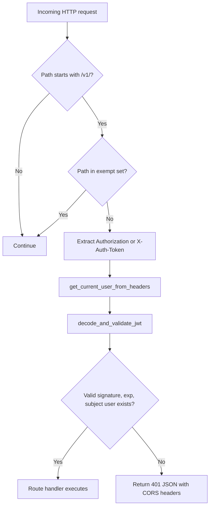
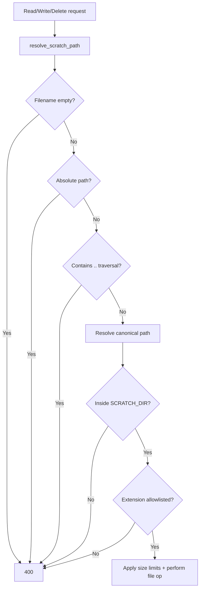

# CATBot Security Overview

Generated: 2026-03-01

## Scope
This document summarizes implemented security controls found in the CATBot codebase, with code references.

Primary reviewed files:
- `src/servers/proxy_server.py`
- `src/servers/todo_store.py`
- `src/servers/scheduled_task_poller.py`
- `src/servers/https_server.py`
- `src/servers/telegram_tools.py`
- `src/integrations/telegram_bot.py`
- `js/app.js`
- Security tests under `tests/`

## High-Level Security Flows

### 1) API Authentication Flow (`/v1/*`)


### 2) Secure Scratch File Access Flow


### 3) MCP Command Hardening Flow
```mermaid
flowchart TD
    A[POST /v1/mcp/servers] --> B[Pydantic ServerConfig extra=forbid]
    B --> C{Client sends command field?}
    C -- Yes --> X[422 rejected]
    C -- No --> D[Persist only MCP_SERVER_SAFE_KEYS]

    E[POST /v1/mcp/servers/{id}/connect] --> F[Load stored preset_id]
    F --> G{preset_id in MCP_PRESETS allowlist?}
    G -- No --> Y[400 rejected]
    G -- Yes --> H[Resolve command/args from preset only]
    H --> I[Never execute client-supplied command]
```

## Implemented Security Measures

## Authentication and Access Control
- Global auth middleware enforces authentication for most `/v1/*` routes: `src/servers/proxy_server.py:1792`.
- Explicit public route allowlist prevents accidental open access outside defined exceptions: `src/servers/proxy_server.py:1798`.
- JWT bearer parsing supports `Authorization` and fallback `X-Auth-Token`: `src/servers/proxy_server.py:1483`.
- JWT validation checks format, HMAC signature, payload parse, and expiration: `src/servers/proxy_server.py:1456`.
- Token subject must map to an existing user in `users_db`: `src/servers/proxy_server.py:1513`.
- Route-level auth dependencies (`Depends(get_current_user)`) on protected endpoints including files, todo, companions, MCP, codex, model-avatar, upload: examples at `src/servers/proxy_server.py:7707`, `3936`, `7995`, `3332`, `3311`, `8069`, `8148`.
- Telegram bot has user authorization guard (admin allowlist or explicit allow-all): `src/integrations/telegram_bot.py:133`.
- Telegram bot startup fails closed when token/admin config is missing: `src/integrations/telegram_bot.py:728`.
- Telegram bot uses `AIORateLimiter` to throttle bot update handling: `src/integrations/telegram_bot.py:750`.

## Password and Token Security
- Passwords are not stored in plaintext; PBKDF2-HMAC-SHA256 with 100,000 iterations and per-user random salt: `src/servers/proxy_server.py:1400`.
- Password verification uses constant-time comparison (`hmac.compare_digest`): `src/servers/proxy_server.py:1418`.
- JWT signing is HMAC-SHA256 with timestamped `iat` and `exp`: `src/servers/proxy_server.py:1440`.

## Bot-to-Proxy Shared Secret Controls
- Optional `TELEGRAM_SECRET` gate on Telegram proxy endpoints: `src/servers/proxy_server.py:1364`, `1569`.
- Secret accepted via `X-Telegram-Secret` or bearer token match when enabled: `src/servers/proxy_server.py:1554`.
- Telegram bot forwards this secret in backend headers when configured: `src/integrations/telegram_bot.py:127`.

## Input Validation and Schema Hardening
- Strong request modeling via Pydantic across auth/todo/files/memory/telegram payloads: `src/servers/proxy_server.py:310`.
- MCP server config rejects unknown fields (`extra="forbid"`), specifically blocking client-supplied `command`: `src/servers/proxy_server.py:313`.
- Todo recurrence interval bounds (`ge=1`, `le=10000`) at schema level: `src/servers/proxy_server.py:369`.
- Unified validation error handler with JSON + CORS headers: `src/servers/proxy_server.py:1922`.

## File System Safety and Data Isolation
- Scratch file operations enforce path traversal protection and directory containment with canonical path checks: `src/servers/proxy_server.py:7344`.
- Absolute paths are rejected (Unix/Windows style): `src/servers/proxy_server.py:7354`.
- Extension allowlists restrict read/write/upload surfaces:
- Read allowlist: `src/servers/proxy_server.py:571`.
- Write allowlist: `src/servers/proxy_server.py:572`.
- Drive upload allowlist: `src/servers/proxy_server.py:574`.
- File size cap protects against oversized read/write payloads: `src/servers/proxy_server.py:576`.
- Companions API path safety uses strict ID regex + `.json` enforcement + containment checks: `src/servers/proxy_server.py:7920`, `7924`.
- Todo storage sanitizes user key to safe filename characters to prevent traversal: `src/servers/todo_store.py:248`.
- Todo writes are atomic via temp-file replace: `src/servers/todo_store.py:234`.

## Command Execution and RCE Mitigations
- MCP execution is preset-only allowlist (`MCP_PRESETS`), with explicit comments and logic to never execute user command strings: `src/servers/proxy_server.py:557`, `1616`, `1636`.
- Legacy `command` fields are stripped during load and never persisted: `src/servers/proxy_server.py:2026`, `2052`.
- Persisted MCP fields are constrained to `MCP_SERVER_SAFE_KEYS`: `src/servers/proxy_server.py:3325`.
- Codex CLI execution uses argument list (`create_subprocess_exec`) rather than shell string execution: `src/servers/proxy_server.py:3232`.
- Codex run is constrained by validated sandbox mode, approval policy, and bounded timeout: `src/servers/proxy_server.py:3194`, `3196`, `3197`, `3212`.
- Telegram restart worker invokes fixed script path with explicit args and no `shell=True`: `src/integrations/telegram_bot.py:576`, `598`, `630`.
- Telegram calculator tool restricts expression chars, length, AST node types before eval: `src/servers/telegram_tools.py:22`, `24`, `157`.

## Network Egress Controls and Safer Proxying
- Weather provider URL config is validated for scheme and hostname allowlist suffix (`open-meteo.com`): `src/servers/proxy_server.py:132`, `2821`, `2825`, `2830`.
- Web fetch crawler is bounded (`max_pages` clamped to 10, `max_depth` clamped to 2): `src/servers/proxy_server.py:2342`, `2343`.
- Crawl expansion is restricted to same-domain links only: `src/servers/proxy_server.py:2394`.
- Outbound calls consistently use explicit HTTP timeouts (multiple endpoints): examples `src/servers/proxy_server.py:2359`, `6119`, `6200`, `6467`.
- Whisper proxy does not forward client auth upstream; it uses only server-side `WHISPER_API_KEY`: `src/servers/proxy_server.py:6436`, `6446`, `6448`.

## Transport Security (TLS/HTTPS)
- Proxy and HTTPS servers sanitize certificate hostname globs to avoid wildcard abuse in file matching: `src/servers/proxy_server.py:306`, `308`; `src/servers/https_server.py:33`, `35`.
- SSL certificate discovery prefers mkcert pairs and supports configured hostname-based lookup: `src/servers/proxy_server.py:8300`, `8326`; `src/servers/https_server.py:213`.
- Proxy starts HTTPS when cert/key are available (uvicorn `ssl_keyfile`/`ssl_certfile`): `src/servers/proxy_server.py:8362`, `8373`.
- Dedicated HTTPS static server uses `ssl.PROTOCOL_TLS_SERVER` and cert chain loading: `src/servers/https_server.py:412`, `413`.
- Local-only TLS verify bypass logic exists for localhost/`.local` self-signed endpoints (TTS and scheduler paths): `src/servers/proxy_server.py:7011`; `src/servers/scheduled_task_poller.py:98`.

## CORS and Error Handling
- CORS middleware configured with explicit allowed methods/headers including auth headers: `src/servers/proxy_server.py:1782`.
- Error handlers attach CORS headers to auth/validation errors to avoid browser-side ambiguity: `src/servers/proxy_server.py:1879`, `1901`, `1922`.

## Secret Handling and Exposure Reduction
- `client-config` endpoint returns only safe client defaults and avoids exposing secrets: `src/servers/proxy_server.py:6068`.
- MCP config logging redacts `apiKey` from printed config object: `src/servers/proxy_server.py:3335`.
- Security event logging added for MCP lifecycle actions (add/update/connect/disconnect/clear): `src/servers/proxy_server.py:1526`.
- Upload-to-drive audit logs capture action outcomes (success/failure) for traceability: `src/servers/proxy_server.py:8247`, `8260`.
- Repository `.gitignore` excludes env files (`*.env*`) to reduce secret commits: `.gitignore:8`.

## Additional Hardening in Supporting Services
- Scheduled task poller authenticates to proxy using service JWT per user and bearer auth header: `src/servers/scheduled_task_poller.py:42`, `123`, `217`.
- Telegram TTS text is sanitized before synthesis request: `src/integrations/telegram_bot.py:342`, `365`.
- Browser frontend sanitizes TTS text before speech output: `js/app.js:2091`.

## Security Test Coverage (Evidence)
- MCP command/preset hardening and auth coverage: `tests/test_mcp_security.py`.
- Scratch path traversal and upload path restrictions: `tests/test_proxy_file_security.py`.
- SSL certificate discovery hostname behavior: `tests/test_proxy_ssl_certificates.py`.
- Telegram TTS sanitization behavior: `tests/test_telegram_tts_sanitization.py`.

## Residual Risk Notes (Observed)
- CORS is currently very permissive (`allow_origins=["*"]`) in proxy and MCP browser server; this is operationally convenient but broad: `src/servers/proxy_server.py:1783`, `src/servers/mcp_browser_server.py:38`.
- Several proxy endpoints are intentionally exempt from auth (chat/models/fetch/news/search/tts); this may be expected for UX, but should be considered exposed surface: `src/servers/proxy_server.py:1798`.
- Frontend stores JWT in `localStorage`, which is vulnerable to XSS-based token theft if XSS is introduced: `js/app.js:264`, `290`.
- Auth debug logs include token previews in middleware logs; useful for debugging, but should be limited in production: `src/servers/proxy_server.py:1855`.

## Quick ASCII Summary Diagram
```text
[Client]
   |
   v
[FastAPI proxy_server]
   |- Auth middleware (/v1/*) -> JWT verify -> route
   |- Telegram secret gate (/v1/telegram/chat)
   |- File ops -> resolve_scratch_path -> extension + size checks
   |- MCP mgmt -> preset allowlist only (no client command execution)
   |- Outbound proxies -> timeout + selected allowlists
   '- Optional HTTPS with discovered certs
```
