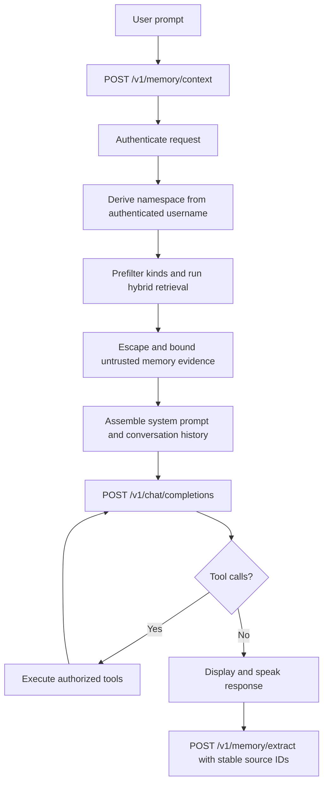
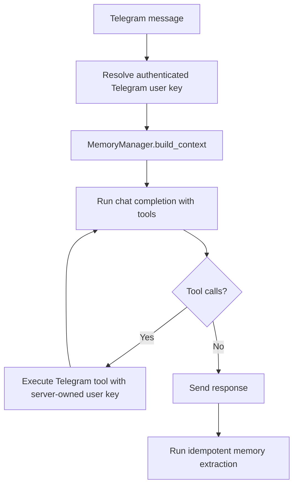
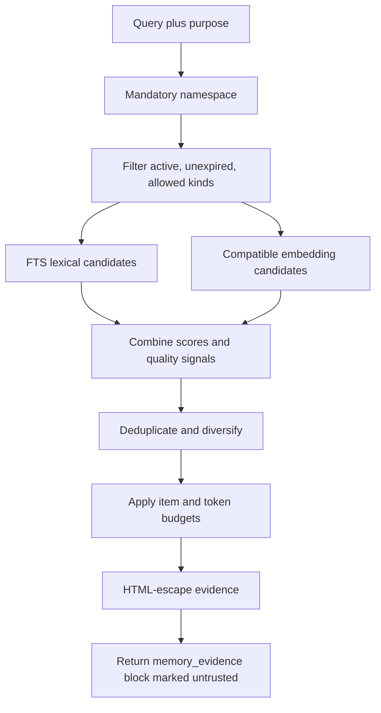
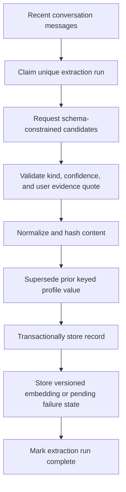
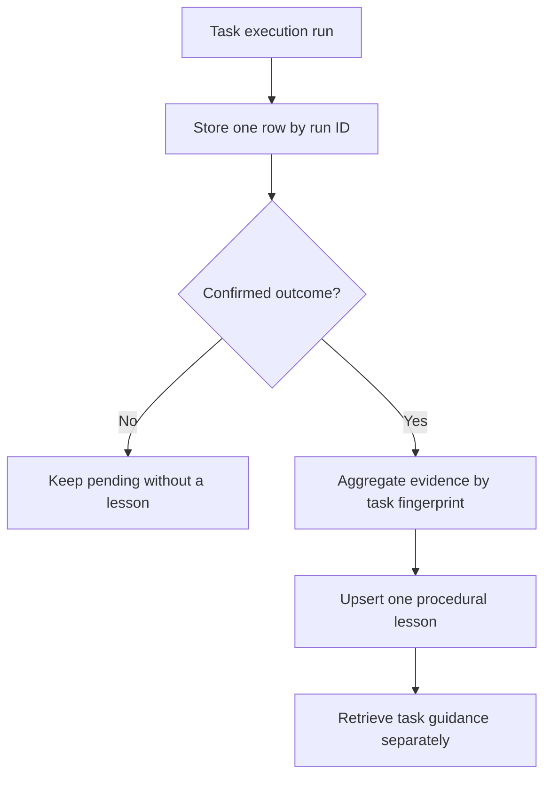

# CATBot System Flow

Last updated: 2026-06-15

## Browser Conversation

The browser does not classify memory questions, rank memories, or format raw
records for prompt injection. It asks the server for a ready-to-use context
block. Philosopher mode skips this normal browser context request because it
uses its own namespace-scoped retrieval path.

## Telegram Conversation

Telegram and Electron use the same retrieval, kind filtering, ranking, and
context safety policy. User-controlled request fields cannot override the
server-owned memory namespace.

## Memory Context

Conversation retrieval accepts personal and episodic kinds only. Task runs are
stored separately and cannot occupy conversation retrieval candidate slots.

## Memory Extraction

Stable conversation and message IDs make extraction replay-safe. Extracted
claims must include evidence that appears in a user message.

## Task Learning

`awaiting_confirmation` is not success. A final lesson is derived only from a
confirmed terminal outcome, and late pending updates cannot downgrade it.

## Storage and Security Boundaries

- `src/servers/memory_api.py` authenticates every memory route.
- `src/memory/sqlite_repository.py` owns SQLite transactions, WAL mode, schema,
  namespace constraints, FTS, embeddings, task runs, and task lessons.
- `src/memory/retrieval_service.py` owns candidate selection and ranking.
- `src/memory/context_builder.py` owns prompt-safe evidence formatting.
- `src/memory/extraction_service.py` owns extraction claims and validation.
- `src/memory/task_learning_service.py` owns confirmed run learning.
- `src/memory/memory_manager.py` is a compatibility facade, not a storage layer.

Short-lived tool notes use `manageWorkingContext`. The legacy
`manageMemoryCache` tool name and `{{MEMORY_CACHE}}` placeholder remain aliases
only for compatibility; neither writes durable long-term memory.
