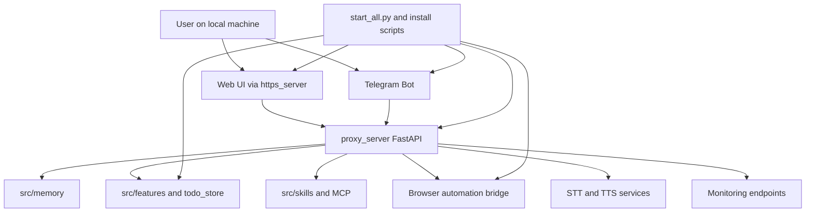

# Self-Hosted Assistant Platform

## Product Purpose
CATBot is designed as a local-first assistant stack that the user runs on their own machine. The repo contains the frontend, backend APIs, runtime services, optional integrations, and startup tooling required to operate the product without depending on a hosted CATBot control plane.

## User-Facing Behavior
- The user opens a local web UI served from the same machine.
- The same local installation can also expose a Telegram bot, browser automation bridge, task scheduler, and optional AutoGen Studio endpoint.
- Most product capabilities stay inside the local deployment boundary unless the user explicitly configures outside services such as LLMs, Brave Search, Spotify, Google Drive, or Telegram.

## How It Works
- `scripts/start_all.py` is the main orchestrator for the standard CATBot runtime. It launches:
- `src.servers.https_server` for serving the web app.
- `src.servers.proxy_server` as the main FastAPI backend.
- `src.servers.scheduled_task_poller` for due-task execution.
- `scripts/start_mcp_browser_use_http_server.py` for the browser-use HTTP server wrapper.
- `scripts/start_mcp_browser_server.py` for the internal Flask bridge.
- `src.integrations.telegram_bot` as an optional chat surface.
- `src/servers/proxy_server.py` becomes the system hub. It brokers chat, files, memory, todo, tools, TTS/STT, integrations, and monitoring.
- The runtime is intentionally modular. CATBot can still be partly useful when some optional services are unavailable, but the core product shape assumes the proxy server is the center of the system.

## Expanded Flow Diagram

## Primary Code References
- `scripts/start_all.py`
  Role: launches the standard CATBot runtime set and verifies required ports.
- `src/servers/https_server.py`
  Role: serves the local frontend over HTTP or HTTPS depending on certificate availability.
- `src/servers/proxy_server.py`
  Role: central API surface and feature router for the entire product.
- `src/servers/mcp_browser_server.py`
  Role: internal bridge from HTTP requests into browser-use/MCP automation flows.
- `src/servers/scheduled_task_poller.py`
  Role: background runner for due recurring or scheduled tasks.
- `src/integrations/telegram_bot.py`
  Role: optional Telegram-facing client process.
- `install.ps1`, `install.sh`, `scripts/install_wizard.py`
  Role: setup and environment bootstrapping.

## Data and Dependencies
- Local runtime expects Python, Node.js, Playwright, and the CATBot project workspace.
- Optional cloud or remote dependencies include OpenAI-compatible chat/TTS/STT backends, Brave Search, Telegram, Spotify, OpenRouter, and Google APIs.
- Runtime state is persisted locally in directories such as `memory_data/`, `todo_data/`, `config/companions/`, `scratch/`, and `status_data/`.

## Constraints and Notes
- CATBot is self-hosted, but not fully offline unless the configured model and tool providers are also local.
- Browser automation is split across multiple cooperating processes and requires the browser-use server path to be healthy.
- Some features are optional and gated by environment variables or external credentials.

## Related Docs
- [CATBot Feature Docs Index](../CATBOT_FEATURE_DOCS_INDEX.md)
- [Security Overview](../SECURITY_OVERVIEW.md)
- [System Flow Diagram](../SYSTEM_FLOW_DIAGRAM.md)

