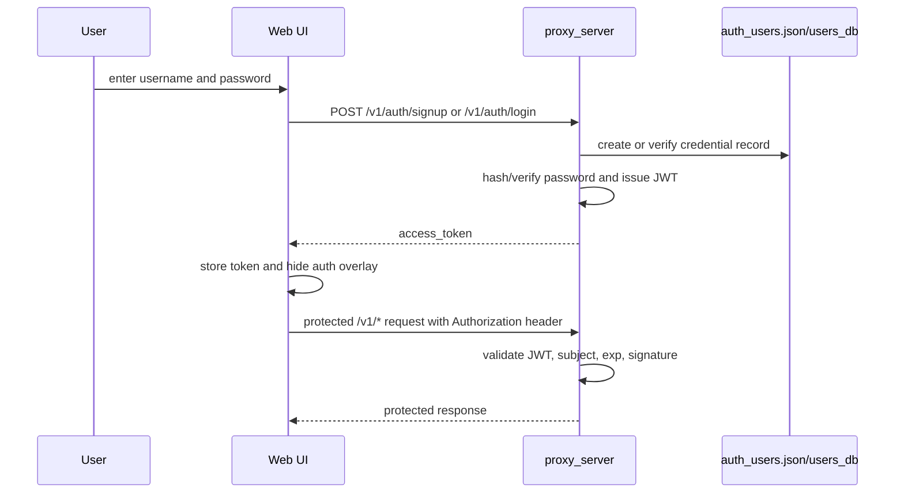

# Authenticated Personal Workspace

## Product Purpose
CATBot is built around the idea of a personal assistant, not a shared anonymous kiosk. Authentication creates a user identity that scopes task lists, companion records, memory access patterns, and protected feature routes.

## User-Facing Behavior
- The web app shows an auth overlay before the main workspace is available.
- Users can sign up, log in, log out, and then operate CATBot with a persistent identity.
- Authenticated requests automatically gain access to user-bound APIs such as todo management, companions, skill execution, Drive upload, and other protected actions.

## How It Works
- `index.html` defines the auth overlay and the login/sign-up controls.
- `js/app.js` performs `POST /v1/auth/signup`, `POST /v1/auth/login`, and `GET /v1/auth/me`.
- `src/servers/proxy_server.py` stores user records, hashes passwords with PBKDF2-HMAC-SHA256, issues HMAC-signed JWTs, and validates bearer tokens through middleware and route dependencies.
- The frontend stores the token in local storage and attaches it to protected requests through the fetch wrapper logic.
- Protected endpoints use `Depends(get_current_user)` or related auth helpers in the proxy server.

## Expanded Flow Diagram

## Primary Code References
- `index.html`
  Elements: `auth-overlay`, `auth-username`, `auth-password`, login/signup/logout buttons.
- `js/app.js`
  Functions and areas: auth token storage, fetch interception, `performAuth()`, `/v1/auth/me` validation path.
- `src/servers/proxy_server.py`
  Functions and areas: password hashing/verification, JWT creation/validation, auth middleware, `get_current_user`, `/v1/auth/signup`, `/v1/auth/login`, `/v1/auth/me`.
- `config/auth_users.json`
  Role: persistent backing store for user records.

## Data and Dependencies
- Passwords are stored as salted password hashes, not plaintext.
- JWTs are signed locally and validated in-process.
- The frontend uses local storage for the bearer token.

## Constraints and Notes
- The system relies on the proxy server secret/JWT configuration remaining stable across requests.
- Local storage token persistence is convenient but means XSS would be a meaningful risk if introduced later.
- Telegram authorization is separate and uses admin allowlists plus optional shared secret handling.

## Related Docs
- [Security Overview](../SECURITY_OVERVIEW.md)
- [Telegram Bot Interface](37_telegram_bot_interface.md)
- [Todo System](18_todo_system.md)

