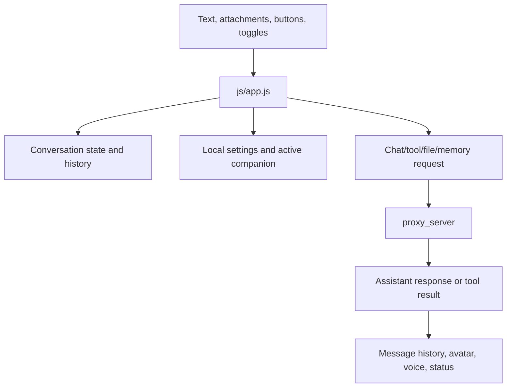

# Responsive Web Chat App

## Product Purpose
The CATBot web app is the main interactive product surface. It combines assistant chat, settings, conversation history, attachments, avatar presentation, and long-running workflow feedback in one responsive browser experience.

## User-Facing Behavior
- Users can open a mobile-friendly UI, sign in, switch conversations, send prompts, attach files, and observe responses directly over the avatar scene.
- The interface exposes settings panels for connection, identity, voice, models, and avatar configuration.
- It can display progress updates while the backend is still working.

## How It Works
- `index.html` contains the full UI shell: auth overlay, mobile header, settings drawer, conversation panel, avatar wrapper, message history, and input controls.
- `js/app.js` owns the runtime behavior: prompt submission, conversation state, attachment preview, settings persistence, tool execution, status polling, and response rendering.
- Most user actions eventually route into `src/servers/proxy_server.py`, which acts as the application backend.
- The CSS in `css/catbot.css` defines the chat-hidden layout, mobile interactions, and settings/companion presentation.

## Expanded Flow Diagram

## Primary Code References
- `index.html`
  Main sections: mobile header, settings overlay, companion builder, avatar wrapper, message history, input area, conversation drawer.
- `js/app.js`
  Main areas: send pipeline, pending attachment management, conversation switching, fetch wrapper, tool bundle builder, status-event polling, avatar initialization, TTS routing.
- `css/catbot.css`
  Role: responsive layout, settings drawer, avatar area styling, chat hide/show behavior.
- `src/servers/proxy_server.py`
  Role: backend target for the web client's major feature calls.

## Data and Dependencies
- Uses browser local storage for auth token, settings, selected voices, and some UI state.
- Depends on the proxy server for almost all dynamic operations.
- Can integrate with browser speech synthesis, camera input, clipboard reads, and upstream model providers.

## Constraints and Notes
- The web app is tightly coupled to the proxy route contract.
- A large part of the product behavior lives client-side in `js/app.js`, so frontend logic is significant, not incidental.
- Some capabilities are hidden or conditional until auth and initialization succeed.

## Related Docs
- [Authenticated Personal Workspace](02_authenticated_personal_workspace.md)
- [Multimodal Inputs](10_multimodal_inputs.md)
- [Monitoring Dashboard](43_monitoring_dashboard.md)

