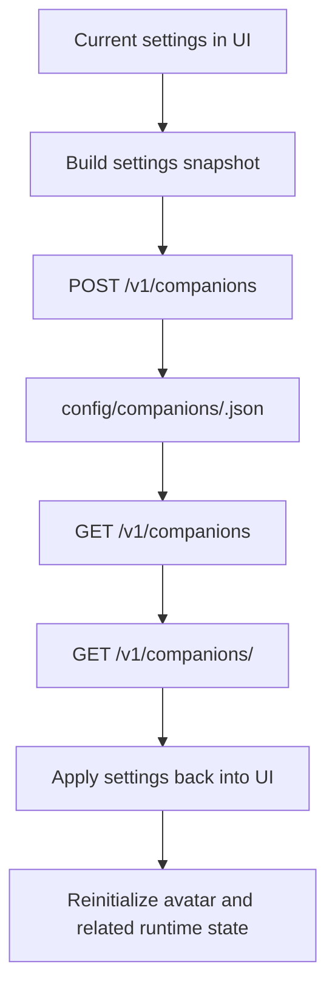

# Character Profiles and Companions

## Product Purpose
Companions let CATBot package a full assistant configuration into a reusable character profile. This makes the product behave more like a configurable cast of assistants than a single fixed chatbot.

## User-Facing Behavior
- Users can save the current CATBot setup as a named profile.
- Saved profiles can be loaded later, deleted, or marked as the default profile to restore on launch.
- A companion reflects the current combination of prompt, model, voice, and avatar settings rather than only a nickname.

## How It Works
- `index.html` exposes the companion list, current setup card, and create-profile modal.
- `js/app.js` serializes the active tool settings into a snapshot, fetches the companion list, loads one companion into the UI, and tracks whether the current state has diverged from the active saved profile.
- `src/servers/proxy_server.py` exposes authenticated CRUD endpoints under `/v1/companions`.
- Each companion is stored as a JSON file under `config/companions/`.

## Expanded Flow Diagram

## Primary Code References
- `index.html`
  Elements: companion builder block, current setup card, companion list, create/save modal.
- `js/app.js`
  Main areas: settings snapshot builder, companion list rendering, default companion handling, active/dirty state tracking, create/load/delete handlers.
- `src/servers/proxy_server.py`
  Routes and helpers: `resolve_companion_path()`, list/get/create/delete companion endpoints.
- `tests/test_companions_api.py`
  Role: validates API behavior and path-safety rules.

## Data and Dependencies
- Companion records live on disk in `config/companions/`.
- Default-companion selection is partially remembered in browser local storage.
- Companion loading can trigger avatar reinitialization and settings reconciliation.

## Constraints and Notes
- Companion IDs are generated by the backend and validated against a safe character set.
- The backend stores companion settings server-side, but some default-selection behavior is still frontend-local.
- Companions are configuration snapshots, not separate long-term personas with independent memory stores.

## Related Docs
- [Avatar System](05_avatar_system.md)
- [Prompt and Persona Layering](12_prompt_and_persona_layering.md)
- [Responsive Web Chat App](03_responsive_web_chat_app.md)

