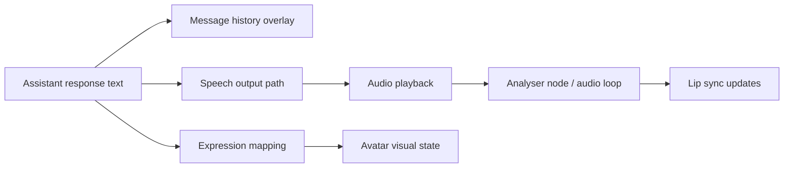

# Expressive Assistant Presence

## Product Purpose
This feature layer makes CATBot feel embodied. It coordinates on-screen messages, avatar reactions, and speech-linked animation so the assistant appears to speak and respond as a character.

## User-Facing Behavior
- Assistant messages are shown directly over the avatar area.
- Voice output can drive lip-sync behavior.
- Avatar expressions can shift based on response or emotional cues.

## How It Works
- `js/app.js` contains the main presentation logic for avatar-linked message rendering, TTS-driven audio analysis, cleanup of active audio graphs, and expression updates.
- `index.html` overlays `message-history` on top of the avatar wrapper so conversation appears inside the same visual scene.
- Client-side audio decoding and scheduling helpers support more natural playback integration, especially for streamed or encoded speech.

## Expanded Flow Diagram

## Primary Code References
- `index.html`
  Elements: `message-history`, avatar wrapper, hidden response output, canvas surfaces.
- `js/app.js`
  Main areas: `updateLive2DExpression`, TTS analyser setup, lip-sync intervals, audio playback handling, message history rendering.
- `libs/ogg-opus-decoder/`
  Role: browser-side decode path for Opus content.
- `recorder-worklet-processor.js`
  Role: browser audio infrastructure used by the voice stack.

## Data and Dependencies
- Relies on frontend audio APIs, requestAnimationFrame loops, and avatar renderers.
- Can work with browser TTS or proxied TTS output depending on configuration.

## Constraints and Notes
- Presentation polish depends on the selected TTS path and browser capabilities.
- Some expression behavior is model-specific and may vary across Live2D assets.
- This is a UI behavior layer, not a distinct backend subsystem.

## Related Docs
- [Avatar System](05_avatar_system.md)
- [Voice Output](08_voice_output.md)
- [Responsive Web Chat App](03_responsive_web_chat_app.md)

