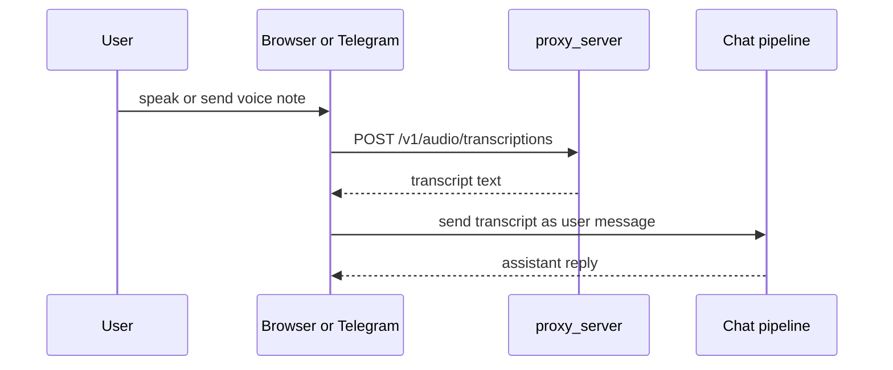

# Voice Input

## Product Purpose
Voice input lets users speak to CATBot rather than only typing. The product treats spoken prompts as first-class inputs on both the web and Telegram surfaces.

## User-Facing Behavior
- In the browser, the user can record speech and send it for transcription.
- In Telegram, the user can send voice notes or audio files and receive normal assistant handling after transcription.
- The resulting transcript is routed into the same core chat pipeline as typed prompts.

## How It Works
- `js/app.js` and browser audio helpers manage microphone capture and request submission.
- `src/servers/proxy_server.py` exposes `/v1/audio/transcriptions` as the unified STT endpoint.
- `src/integrations/telegram_bot.py` handles `VOICE` and `AUDIO` updates, downloads the media payload from Telegram, sends it to the transcription endpoint, and then continues to chat handling using the transcript.

## Expanded Flow Diagram

## Primary Code References
- `js/app.js`
  Main areas: microphone control, voice-input button path, prompt submission after transcription.
- `recorder-worklet-processor.js`
  Role: browser-side recording support.
- `src/servers/proxy_server.py`
  Route: `/v1/audio/transcriptions`.
- `src/integrations/telegram_bot.py`
  Functions and areas: voice/audio handlers, backend transcription call, transcript extraction.

## Data and Dependencies
- Depends on an upstream Whisper-compatible or equivalent transcription backend unless a local route is configured to provide it.
- Telegram voice intake depends on the Telegram Bot API media download path.

## Constraints and Notes
- Voice input quality is ultimately bounded by the configured STT service.
- Telegram voice handling respects maximum duration and bot configuration flags.
- The transcript path is unified, so downstream chat behavior does not need separate voice-specific logic.

## Related Docs
- [Voice Output](08_voice_output.md)
- [Telegram Voice Support](09_telegram_voice_support.md)
- [Telegram Bot Interface](37_telegram_bot_interface.md)

