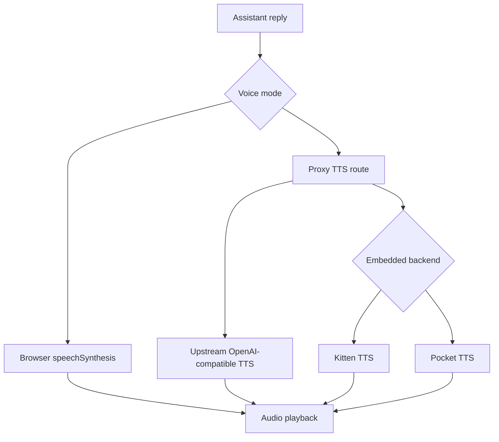

# Voice Output

## Product Purpose
Voice output gives CATBot a spoken assistant layer across both browser and Telegram interfaces. It supports cloud, embedded local, and browser-native speech paths.

## User-Facing Behavior
- In the web UI, users can pick a browser voice or switch to OpenAI-compatible and embedded TTS backends.
- CATBot can refresh available voices from a configured endpoint.
- Assistant replies can be spoken automatically and can drive lip-sync behavior.

## How It Works
- `index.html` exposes the voice controls: browser voice dropdown, TTS service toggle, endpoint field, model dropdown, and voice dropdown.
- `js/app.js` decides which TTS path to use, loads voice lists, and requests speech audio from the proxy when using non-browser output.
- `src/servers/proxy_server.py` serves:
- `/v1/audio/voices` and `/v1/audio/speech` for embedded local TTS.
- `/v1/proxy/tts/voices` and `/v1/proxy/tts/speech` for upstream TTS proxying.
- Embedded backends include Kitten TTS and Pocket TTS, selected through environment configuration and model routing.

## Expanded Flow Diagram

## Primary Code References
- `index.html`
  Elements: `voice-dropdown`, `tts-service-microsoft`, `tts-service-openai`, `tts-endpoint-url`, `tts-model-dropdown`, `tts-voice-dropdown`.
- `js/app.js`
  Main areas: voice loading, endpoint selection, TTS fetch logic, playback integration, lip-sync integration.
- `src/servers/proxy_server.py`
  Routes and helpers: embedded voice listing, embedded speech generation, TTS proxy voice route, TTS proxy speech route, local TLS bypass logic for local endpoints.
- `tests/test_embedded_tts_routing.py`
- `tests/test_tts_ui_fallbacks.py`

## Data and Dependencies
- Browser mode depends on `speechSynthesis`.
- Proxy mode depends on configured TTS endpoints or embedded models.
- Embedded local TTS depends on optional installed Python packages and model/runtime settings.

## Constraints and Notes
- Local self-signed TTS endpoints may require special TLS handling already built into the proxy.
- Voice availability depends on the selected model and backend.
- The chosen TTS path affects audio format, latency, and how well lip-sync can be driven.

## Related Docs
- [Expressive Assistant Presence](06_expressive_assistant_presence.md)
- [Telegram Voice Support](09_telegram_voice_support.md)
- [Telegram Bot Interface](37_telegram_bot_interface.md)

