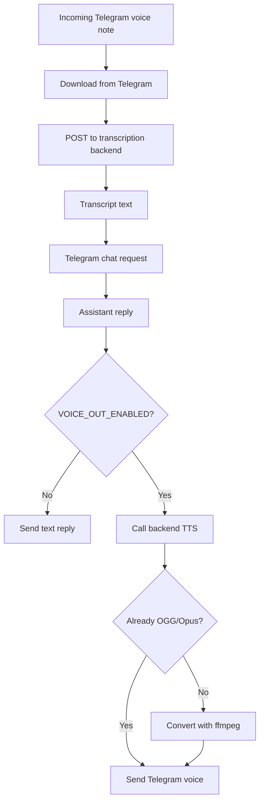

# Telegram Voice Support

## Product Purpose
Telegram voice support makes CATBot usable as a spoken assistant within Telegram rather than only as a text bot.

## User-Facing Behavior
- Users can send Telegram voice notes or audio files and have CATBot transcribe them automatically.
- When enabled, CATBot can answer with spoken audio and, when needed, convert that audio into Telegram-compatible OGG/Opus voice notes.

## How It Works
- `src/integrations/telegram_bot.py` detects voice and audio updates.
- The bot downloads the media bytes from Telegram and posts them to the transcription endpoint.
- For outbound speech, the bot calls backend TTS, checks whether the result is already OGG/Opus, and converts it with `ffmpeg` when necessary.
- The bot also filters out transient planning text so only meaningful replies are voiced.

## Expanded Flow Diagram

## Primary Code References
- `src/integrations/telegram_bot.py`
  Main areas: `_voice_file_info`, `handle_voice`, `call_backend_transcription`, `call_backend_tts`, `_ensure_telegram_voice_note_audio`, `_send_voice_reply`.
- `src/servers/proxy_server.py`
  Role: shared transcription and TTS endpoints used by the Telegram client.
- `tests/test_telegram_voice_note_conversion.py`
- `tests/test_telegram_tts_sanitization.py`

## Data and Dependencies
- Requires Telegram Bot API access plus backend STT/TTS routes.
- OGG/Opus conversion depends on `ffmpeg` availability when the source TTS format is not already Telegram-friendly.

## Constraints and Notes
- Voice output is optional and controlled by environment flags.
- Long or unsupported audio may be rejected by Telegram or the bot's configured safety limits.
- Telegram voice support is additive to, not separate from, the normal assistant conversation logic.

## Related Docs
- [Voice Input](07_voice_input.md)
- [Voice Output](08_voice_output.md)
- [Telegram Bot Interface](37_telegram_bot_interface.md)

