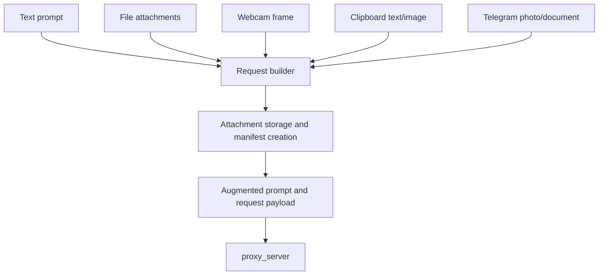

# Multimodal Inputs

## Product Purpose
CATBot accepts more than plain text. It can work from attachments, Telegram media, webcam frames, and clipboard content so that the assistant can reason over the artifacts users already have.

## User-Facing Behavior
- Web users can attach files, use webcam mode, and enable clipboard vision mode.
- Telegram users can send photos and documents.
- Attachments become part of the assistant context and can also be inspected through file tools.

## How It Works
- `index.html` and `js/app.js` manage attachment input, preview, removal, and upload state.
- `js/app.js` also manages webcam capture and clipboard monitoring/preview.
- `src/integrations/telegram_bot.py` wraps Telegram photos and documents into backend attachment payloads.
- `src/servers/proxy_server.py` stores attachments safely, builds attachment manifests, and can augment prompts so models or tools know what files were attached.

## Expanded Flow Diagram

## Primary Code References
- `index.html`
  Elements: attachment input, preview list, webcam preview, clipboard preview.
- `js/app.js`
  Main areas: pending attachment state, webcam processing, clipboard monitoring, attachment-aware prompt construction.
- `src/integrations/telegram_bot.py`
  Main areas: document/photo handling and backend attachment payload generation.
- `src/servers/proxy_server.py`
  Helpers and routes: attachment storage, attachment manifest generation, scratch-safe content access, vision attachment augmentation.

## Data and Dependencies
- Files are stored in the scratch workspace and referenced into later operations.
- Vision flows depend on a configured vision-capable model path when image understanding is required.

## Constraints and Notes
- Attachment counts and file sizes are bounded in the client and backend.
- Files are not blindly injected as raw bytes into prompts; they are normalized into safer and more structured request forms.
- Some attachment types are better handled through skill/file tools than by direct prompt text alone.

## Related Docs
- [Responsive Web Chat App](03_responsive_web_chat_app.md)
- [File Workspace](28_file_workspace.md)
- [Document Support](29_document_support.md)

