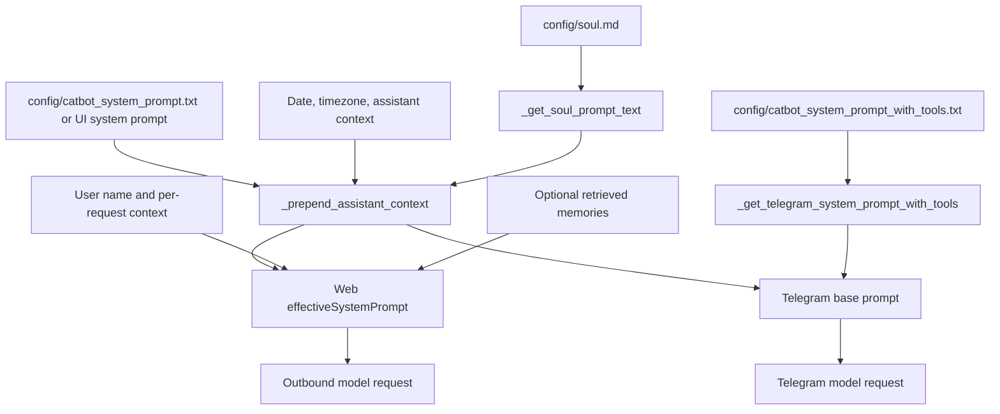

# Prompt and Persona Layering

## Product Purpose
CATBot separates operational instructions from personality. The product can combine runtime rules, tool-aware system behavior, assistant identity, and a persistent `soul.md` persona layer so the assistant behaves like a configured character instead of a generic API wrapper.

## User-Facing Behavior
- The settings UI exposes an editable system prompt field and a read-only preview of the loaded `config/soul.md` text.
- The same persona layer is intended to influence both the web UI and Telegram flows.
- Tool-enabled Telegram can switch to a different base prompt that includes tool guidance while still inheriting CATBot’s assistant context and soul/persona text.
- User identity fields in the settings can be folded into the active prompt so the assistant responds with more personalized context.

## How It Works
- `src/servers/proxy_server.py` defines `CATBOT_SYSTEM_PROMPT_FILE`, `CATBOT_SYSTEM_PROMPT_WITH_TOOLS_FILE`, and `SOUL_PROMPT_FILE` so prompt content can be loaded from local config files instead of being hardcoded in the UI.
- `_get_soul_prompt_text()` reads `config/soul.md` and returns the optional persona text block.
- `_prepend_assistant_context(base_prompt)` composes the effective prompt by prepending runtime context such as current date, timezone, and knowledge-gap guidance, then appending soul/persona text before the base system prompt.
- Telegram uses `_get_telegram_system_prompt()` for normal conversation and `_get_telegram_system_prompt_with_tools()` when tool-enabled Telegram is active.
- `_sanitize_telegram_legacy_tool_prompt()` prevents older prompt formats from leaking incompatible tool-instruction structure into the newer Telegram flow.
- In the browser, `js/app.js` builds `effectiveSystemPrompt` from the visible system prompt text, optional user-name context, and any automatically retrieved memory context before sending the request.
- The frontend also loads the backend-provided `soulPrompt` value so the user can inspect the persona layer without directly editing the file from the UI.

## Expanded Flow Diagram

## Primary Code References
- `index.html`
  Settings controls for the editable `System Prompt` and read-only `soul-prompt-display`.
- `js/app.js`
  Request assembly path around `effectiveSystemPrompt`, user-name injection, and memory-context augmentation.
- `src/servers/proxy_server.py`
  Prompt file constants: `CATBOT_SYSTEM_PROMPT_FILE`, `CATBOT_SYSTEM_PROMPT_WITH_TOOLS_FILE`, and `SOUL_PROMPT_FILE`.
- `src/servers/proxy_server.py`
  Prompt helpers: `_get_soul_prompt_text()`, `_prepend_assistant_context()`, `_get_telegram_system_prompt()`, `_get_telegram_system_prompt_with_tools()`, and `_sanitize_telegram_legacy_tool_prompt()`.
- `config/soul.md`
  Persona layer describing CATBot’s voice, stance, and behavioral texture.
- `config/catbot_system_prompt.txt`
  Base product/system rules for standard operation.
- `config/catbot_system_prompt_with_tools.txt`
  Tool-oriented prompt variant for Telegram tool mode.

## Data and Dependencies
- Persona and system behavior are file-driven, which means prompt changes survive restarts and apply across sessions.
- The frontend depends on the backend to expose the current soul prompt text for display.
- Memory-aware conversation can append an additional retrieved-context layer on top of the system and soul prompt stack.

## Constraints and Notes
- Persona depth depends on prompt composition discipline. If downstream code bypasses the standard prompt builder, behavior can drift between surfaces.
- The UI intentionally treats `soul.md` as read-only because it is part of the repo/config layer, not just a transient browser preference.
- Telegram prompt handling is more specialized than the web path because it has to support both standard chat and tool-enabled chat in the same backend.

## Related Docs
- [Authenticated Personal Workspace](02_authenticated_personal_workspace.md)
- [Automatic Memory-Aware Conversation](13_automatic_memory_aware_conversation.md)
- [Telegram Bot Interface](37_telegram_bot_interface.md)
