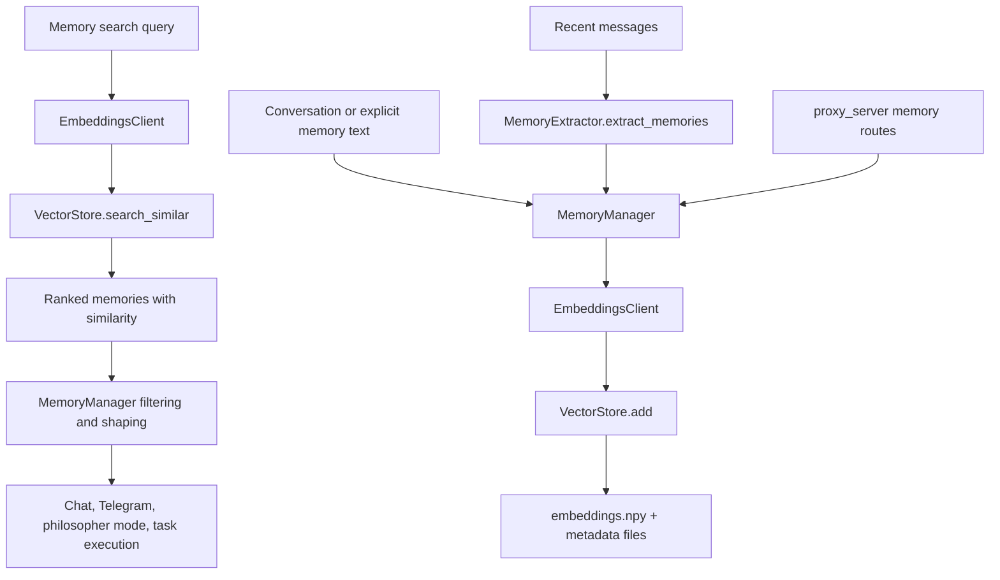

# Long-Term Memory System

## Product Purpose
CATBot’s long-term memory system gives the assistant persistence across sessions. It stores semantically meaningful memories, retrieves them by similarity, exposes CRUD-style API routes, and supports downstream features such as personalization, philosopher mode, and task learning.

## User-Facing Behavior
- Users can store, search, list, inspect, and delete memories through backend routes and tool surfaces.
- Relevant past facts, preferences, and conclusions can reappear in later conversations.
- Other product features can rely on memory without each one implementing its own storage stack.
- The system supports both explicit user-driven memory actions and automatic extraction from conversation history.

## How It Works
- `src/memory/embeddings_client.py` turns memory text into normalized embedding vectors suitable for cosine similarity search.
- `src/memory/vector_store.py` persists those normalized vectors in `embeddings.npy` and stores aligned metadata in JSON-backed records.
- `VectorStore.search_similar(...)` performs cosine similarity search over the stored embedding matrix, applies the configured threshold, and returns ranked memory results with `similarity` scores.
- `src/memory/memory_manager.py` is the orchestration layer. It owns memory storage, search, extraction, duplicate handling, and specialized task-learning context logic.
- `store_memory(...)` creates the embedding-backed persistent record, while `search_memories(...)` wraps vector search and category filtering.
- `extract_memories_from_conversation(...)` calls `src/memory/memory_extractor.py`, which uses an LLM-assisted extraction step to turn recent conversation turns into candidate memories.
- `src/servers/proxy_server.py` exposes the main API layer:
- `/v1/memory/store`
- `/v1/memory/search`
- `/v1/memory/list`
- `/v1/memory/{memory_id}`
- `/v1/memory/extract`
- `/v1/memory/{memory_id}` with `DELETE`
- `/v1/memory/status`
- `/v1/memory/learning/events`
- `/v1/memory/learning/context`

## Expanded Flow Diagram

## Primary Code References
- `src/memory/embeddings_client.py`
  Embedding generation and vector normalization for storage and query paths.
- `src/memory/vector_store.py`
  Persistent similarity index using numpy arrays and cosine-similarity search.
- `src/memory/memory_manager.py`
  Core orchestration class `MemoryManager`, including `store_memory(...)`, `search_memories(...)`, and `extract_memories_from_conversation(...)`.
- `src/memory/memory_extractor.py`
  LLM-assisted extraction of memory candidates from conversation turns.
- `src/servers/proxy_server.py`
  Memory API surface, including `/v1/memory/store`, `/v1/memory/search`, `/v1/memory/list`, `/v1/memory/extract`, `/v1/memory/status`, and task-learning endpoints.
- `tests/test_memory_manager.py`
  Behavioral coverage for manager-layer memory logic.
- `tests/test_memory_vector_store.py`
  Retrieval and persistence coverage for the vector-store layer.

## Data and Dependencies
- Persistent storage lives under the configured memory storage path and includes vector arrays, metadata, and task-learning event logs.
- Embedding quality depends on the configured embedding provider or compatible model path.
- Retrieval depends on vector normalization being consistent between stored memories and search queries.

## Constraints and Notes
- This is not a full database abstraction; it is a focused memory subsystem built around embedding similarity and metadata filtering.
- The memory layer is used by multiple product features, so failures here degrade personalization, philosopher mode, Telegram memory actions, and task-learning support together.
- The system’s usefulness depends heavily on memory-quality controls that prevent the vector store from filling with low-value noise.

## Related Docs
- [Automatic Memory-Aware Conversation](13_automatic_memory_aware_conversation.md)
- [Memory Quality Controls](15_memory_quality_controls.md)
- [Task-Learning Memory](16_task_learning_memory.md)
