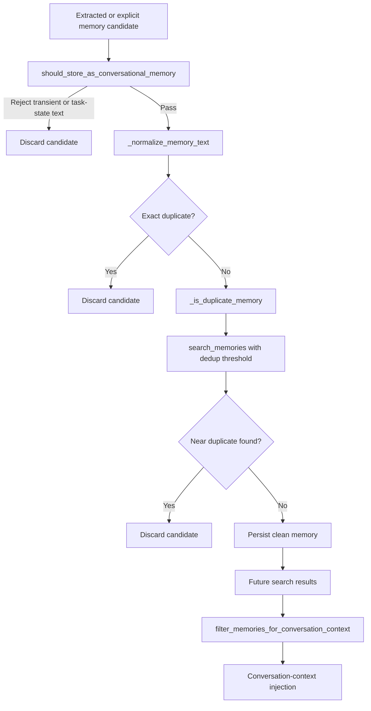

# Memory Quality Controls

## Product Purpose
CATBot does not treat every candidate memory as worth preserving. The memory-quality layer exists to stop noisy, repetitive, low-durability, or purely operational text from contaminating the assistant's long-term context.

## User-Facing Behavior
- Durable user preferences, facts, and conclusions are more likely to be kept.
- Transient task chatter, status lists, and short-lived operational fragments are intentionally filtered out.
- Repeated or near-duplicate memories are rejected instead of being stored again and again.
- The same filters also protect future conversation context so retrieval returns cleaner, more useful memory snippets.

## How It Works
- `src/memory/memory_manager.py` defines conversational-memory guardrails in `should_store_as_conversational_memory(...)`.
- The manager explicitly excludes task-learning categories from normal conversational memory so operational lessons and user facts do not get mixed together.
- `filter_memories_for_conversation_context(...)` removes memories that should not be injected back into ordinary chat, including operational or task-state contamination.
- Duplicate protection works at two levels:
- `_normalize_memory_text(...)` supports exact or near-exact duplicate checking.
- `_is_duplicate_memory(...)` performs a semantic near-duplicate search using `search_memories(...)` and the configured extraction dedup similarity threshold.
- The extraction pipeline in `extract_memories_from_conversation(...)` uses these checks before writing new memories, which keeps automatic extraction from spamming the store.
- Telegram memory storage also respects the same manager guard via `should_store_as_conversational_memory(...)` before allowing memory writes from tool usage.

## Expanded Flow Diagram

## Primary Code References
- `src/memory/memory_manager.py`
  Filtering and storage guardrails: `should_store_as_conversational_memory(...)`.
- `src/memory/memory_manager.py`
  Retrieval-context guardrails: `filter_memories_for_conversation_context(...)`.
- `src/memory/memory_manager.py`
  Duplicate-control helpers: `_normalize_memory_text(...)` and `_is_duplicate_memory(...)`.
- `src/memory/memory_manager.py`
  Extraction path: `extract_memories_from_conversation(...)` applies filtering before persistence.
- `src/servers/telegram_tools.py`
  Telegram memory writes check the memory-manager guard before storing conversational memories.
- `tests/test_memory_manager.py`
  Tests around filtering and acceptance/rejection logic.
- `tests/test_memory_vector_store.py`
  Lower-level search and retrieval behavior that quality controls depend on.

## Data and Dependencies
- Uses configured similarity thresholds, category settings, and task-learning category lists from the memory manager.
- Relies on vector search to detect semantic duplicates, not just string-matching duplicates.
- Affects both stored memory quality and future context-injection quality.

## Constraints and Notes
- Quality control is heuristic rather than perfect. It reduces contamination risk but cannot guarantee that every stored memory is ideal.
- The filters intentionally trade recall for quality. Some borderline memories will be dropped to keep the overall memory set useful.
- If these filters are loosened too far, downstream personalization quality degrades because retrieval starts surfacing noisy operational fragments.

## Related Docs
- [Long-Term Memory System](14_long_term_memory_system.md)
- [Task-Learning Memory](16_task_learning_memory.md)
- [Tool-Enabled Telegram](38_tool_enabled_telegram.md)
