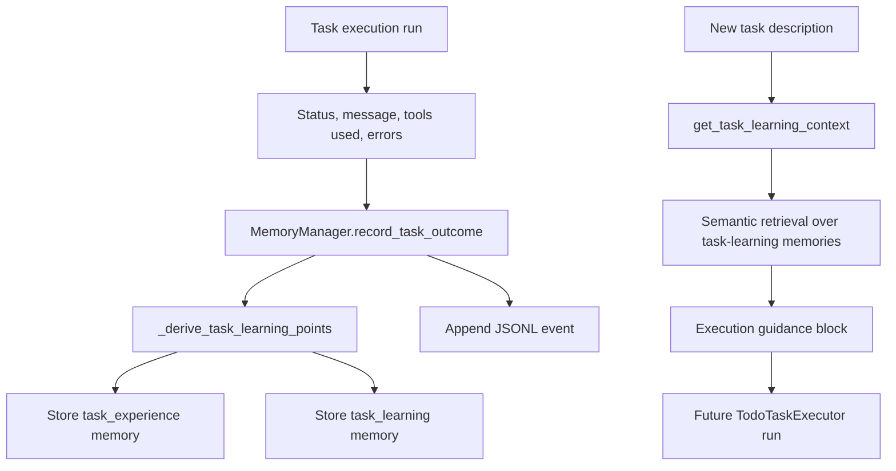

# Task-Learning Memory

## Product Purpose
CATBot does not only remember conversational facts. It also records what happened during task execution so similar future tasks can inherit practical guidance from prior runs, including successes, failures, tool patterns, and repeated mistakes.

## User-Facing Behavior
- After a task run finishes, CATBot can retain operational lessons instead of treating the run as disposable.
- Similar future tasks can receive execution guidance derived from earlier outcomes.
- The system distinguishes between raw task events and reusable distilled learning points.
- Task-learning data is queryable through dedicated memory-learning endpoints rather than being mixed blindly into normal conversational memory.

## How It Works
- `src/memory/memory_manager.py` enables a dedicated task-learning mode with separate categories such as `task_experience` and `task_learning`.
- `record_task_outcome(...)` receives structured task run data, including task description, final status, message, tool usage, and errors.
- The manager derives compact learning points through `_derive_task_learning_points(...)`, writes a full event record into `task_learning_events.jsonl`, and optionally stores condensed memories back into the vector store.
- The stored event log preserves richer operational detail, while the vector-backed `task_experience` and `task_learning` entries support future semantic retrieval.
- `get_task_learning_context(...)` searches those stored learning memories with task-learning-specific thresholds and limits, then builds reusable execution context for similar tasks.
- `src/servers/proxy_server.py` exposes `/v1/memory/learning/events` for event listing and `/v1/memory/learning/context` for retrieval of condensed guidance.
- Task execution completion paths in `src/servers/proxy_server.py` call `memory_manager.record_task_outcome(...)` once a run has reached a terminal or semi-terminal state such as awaiting confirmation or cancellation.

## Expanded Flow Diagram

## Primary Code References
- `src/memory/memory_manager.py`
  Task-learning setup fields such as `task_learning_enabled`, `task_learning_search_limit`, and `task_learning_similarity_threshold`.
- `src/memory/memory_manager.py`
  Event persistence and retrieval: `_append_task_learning_event(...)`, `list_task_learning_events(...)`, and `task_learning_events_file`.
- `src/memory/memory_manager.py`
  Core task-learning methods: `record_task_outcome(...)` and `get_task_learning_context(...)`.
- `src/memory/memory_manager.py`
  Distillation helper: `_derive_task_learning_points(...)`.
- `src/servers/proxy_server.py`
  Memory-learning routes: `/v1/memory/learning/events` and `/v1/memory/learning/context`.
- `src/servers/proxy_server.py`
  Task-execution completion paths that call `memory_manager.record_task_outcome(...)`.
- `src/features/task_execution.py`
  Produces the run outcomes, statuses, and messages that feed the learning layer.

## Data and Dependencies
- Persistent event storage lives in `task_learning_events.jsonl` under the memory storage directory.
- Condensed learning memories are stored in the same vector-backed memory system but under separate categories.
- Retrieval depends on semantic similarity between the new task description and prior task-learning entries.

## Constraints and Notes
- Task-learning memory is intentionally separated from conversational memory so procedural lessons do not pollute personality/context retrieval.
- The quality of future guidance depends on the executor producing useful summaries and tool/error traces.
- Because final task completion requires human confirmation, CATBot can record an outcome before the todo item is actually removed or rescheduled.

## Related Docs
- [Long-Term Memory System](14_long_term_memory_system.md)
- [Memory Quality Controls](15_memory_quality_controls.md)
- [Task Execution Engine](20_task_execution_engine.md)
