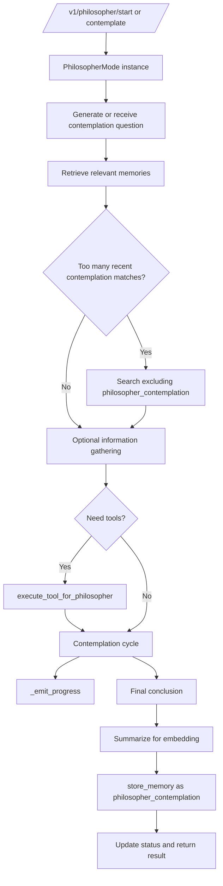

# Philosopher Mode

## Product Purpose
Philosopher Mode turns CATBot from a purely reactive assistant into a reflective one. It can generate its own questions, gather context, use tools, contemplate answers over multiple steps, and store the resulting conclusions back into memory.

## User-Facing Behavior
- Users can start, stop, inspect, and manually trigger contemplations through dedicated API routes.
- When active, philosopher mode explores questions in a self-directed loop rather than waiting only for user prompts.
- The mode can emit progress updates so the system can surface reflective workflow state in monitors or logs.
- Completed contemplations are summarized and written back into memory as persistent philosophical conclusions.

## How It Works
- `src/features/philosopher_mode.py` implements the `PhilosopherMode` class and owns the contemplation lifecycle.
- The constructor accepts a model client, memory manager, tool executor, `get_tools_func`, and `progress_callback`, which makes philosopher mode a composable agent loop rather than a hardcoded prompt trick.
- The mode retrieves relevant memories before thinking, using the shared memory manager and optional exclusion of recent `philosopher_contemplation` items to diversify topics.
- `_gather_information_if_needed(...)` can ask the LLM whether tools should be used to gather facts before the actual contemplation continues.
- During contemplation cycles, the mode can call tools, loop through reasoning steps, and enforce tool-iteration bounds so it does not spin forever.
- `_emit_progress(...)` forwards progress events back to the host process, and `src/servers/proxy_server.py` temporarily replaces the progress callback with monitor-aware handlers during active runs.
- Before storing results, philosopher mode summarizes the conclusion to improve embedding quality, then stores it via `memory_manager.store_memory(...)` using category `philosopher_contemplation` and source `philosopher_mode`.
- `src/servers/proxy_server.py` exposes `/v1/philosopher/start`, `/v1/philosopher/stop`, `/v1/philosopher/status`, and `/v1/philosopher/contemplate`, while keeping per-conversation state in `philosopher_mode_active` and `philosopher_mode_instances`.

## Expanded Flow Diagram

## Primary Code References
- `src/features/philosopher_mode.py`
  Core class: `PhilosopherMode`.
- `src/features/philosopher_mode.py`
  Progress/reporting path: `_emit_progress(...)`.
- `src/features/philosopher_mode.py`
  Tool-aware discovery and use: `get_tools_func`, `_gather_information_if_needed(...)`, and `tool_executor`.
- `src/features/philosopher_mode.py`
  Memory integration: retrieval, `_build_memory_context(...)`, conclusion summarization, and storage under `philosopher_contemplation`.
- `src/servers/proxy_server.py`
  Runtime registries: `philosopher_mode_active` and `philosopher_mode_instances`.
- `src/servers/proxy_server.py`
  Routes: `/v1/philosopher/start`, `/v1/philosopher/stop`, `/v1/philosopher/status`, and `/v1/philosopher/contemplate`.
- `src/servers/proxy_server.py`
  Tool bridge: `execute_tool_for_philosopher(...)` and `get_all_available_tools(...)`.
- `tests/test_philosopher_mode.py`
  Behavioral coverage for contemplation logic and memory interactions.

## Data and Dependencies
- Depends on the memory system for retrieval and conclusion storage.
- Depends on the shared tool registry and tool executor if philosopher mode is allowed to gather external information.
- Per-conversation active state lives in memory on the proxy process while stored contemplations persist in the normal memory subsystem.

## Constraints and Notes
- Philosopher mode deliberately bypasses the standard automatic memory-aware conversation shortcut because it already has its own retrieval and contemplation flow.
- Topic diversification is an explicit safeguard against repeatedly thinking about the same recently stored contemplations.
- This is a higher-cost feature than ordinary chat because it can involve multi-step reasoning, tool use, and memory writes in a single cycle.

## Related Docs
- [Automatic Memory-Aware Conversation](13_automatic_memory_aware_conversation.md)
- [Long-Term Memory System](14_long_term_memory_system.md)
- [MCP Extensibility](41_mcp_extensibility.md)
