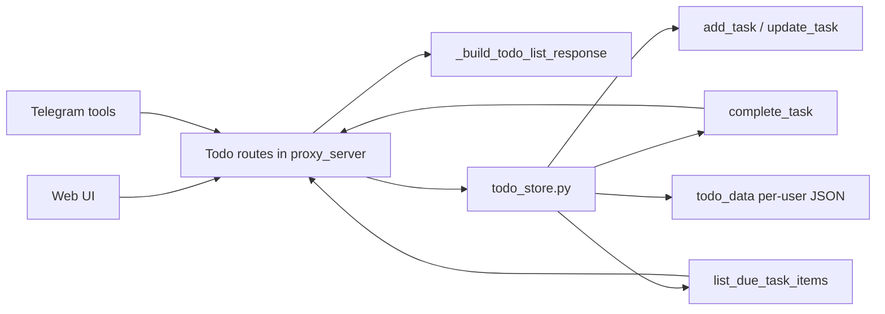

# Todo System

## Product Purpose
CATBot's todo system gives the assistant a durable unit of work. It stores structured task items per user, exposes them through authenticated APIs, and acts as the base layer for scheduled automation and agentic task execution.

## User-Facing Behavior
- Each authenticated user has a persistent todo list.
- Tasks can be added, updated, listed, deleted, cleared, completed, or filtered for due status.
- Web and Telegram use the same backend store, so task state stays aligned across both surfaces.
- Tasks keep stable numeric `task_id` values so execution, completion, and references remain consistent.

## How It Works
- `src/servers/todo_store.py` is the persistence layer. It builds normalized task objects with `_build_task_item(...)` and stores them in per-user JSON files under `todo_data/`.
- `add_task(...)`, `update_task(...)`, `complete_task(...)`, and `list_due_task_items(...)` are the main data operations used by higher layers.
- The proxy defines Pydantic request/response models such as `TodoListResponse`, `TodoItemResponse`, `TodoUpdateRequest`, and related execution request types.
- `src/servers/proxy_server.py` exposes the todo API:
- `GET /v1/todo`
- `GET /v1/todo/due`
- `POST /v1/todo`
- `PATCH /v1/todo/{task_id}`
- `DELETE /v1/todo/{task_id}`
- `DELETE /v1/todo`
- `POST /v1/todo/{task_id}/complete`
- `_build_todo_list_response(...)` converts stored task items into stable API payloads, including scheduler metadata such as `scheduledFor`, `nextRunAt`, `recurrence`, and `isDue`.
- Telegram tools call the same store-backed operations instead of maintaining a parallel in-memory todo implementation.

## Expanded Flow Diagram

## Primary Code References
- `src/servers/todo_store.py`
  Task-shaping helper: `_build_task_item(...)`.
- `src/servers/todo_store.py`
  Main persistence operations: `add_task(...)`, `update_task(...)`, `complete_task(...)`, and `list_due_task_items(...)`.
- `src/servers/proxy_server.py`
  Todo schema classes: `TodoListResponse`, `TodoUpdateRequest`, `TodoExecuteResponse`, and `TodoExecutionStatusResponse`.
- `src/servers/proxy_server.py`
  Route helpers: `_todo_recurrence_to_dict(...)` and `_build_todo_list_response(...)`.
- `src/servers/proxy_server.py`
  Todo routes from `GET /v1/todo` through `POST /v1/todo/{task_id}/complete`.
- `src/servers/telegram_tools.py`
  Tool path that forwards Telegram todo actions into the persistent store.
- `tests/test_todo_store.py`
  Store-level behavior validation.

## Data and Dependencies
- Todo state is stored locally in per-user JSON files, not in browser-only local storage.
- Authenticated user identity determines which todo file is read or written.
- Execution, scheduling, Telegram notifications, and monitor dashboards all depend on this store remaining coherent.

## Constraints and Notes
- Stable task IDs matter because task execution and completion routes refer to concrete numeric IDs rather than position in the list.
- The todo system is intentionally more structured than a plain text list because later layers need schedule, recurrence, and execution metadata.
- Because multiple product surfaces touch the same store, normalization in the backend is more important than UI-level convenience logic.

## Related Docs
- [Authenticated Personal Workspace](02_authenticated_personal_workspace.md)
- [Scheduling and Recurrence](19_scheduling_and_recurrence.md)
- [Task Execution Engine](20_task_execution_engine.md)
