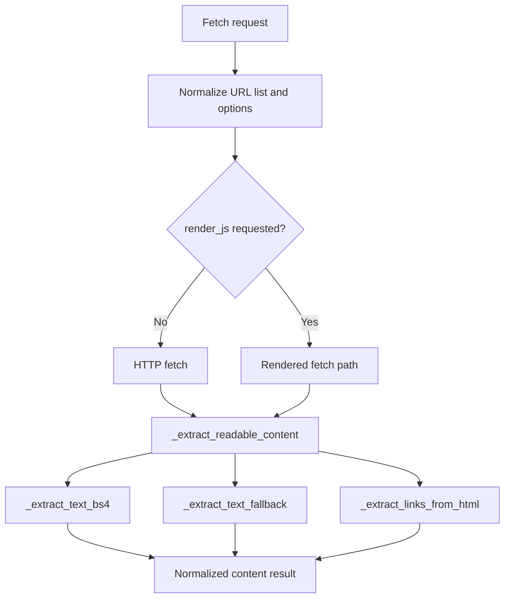

# Web Fetch and Scraping

## Product Purpose
CATBot includes a direct content-retrieval layer for websites. This gives the product a fast path for pulling readable text from pages without always escalating into full browser automation.

## User-Facing Behavior
- Users or higher-level tools can fetch one or more URLs for readable content.
- Requests can opt into JavaScript rendering when static HTTP fetch is not enough.
- The fetch path supports selector waits, timing controls, and multi-URL retry behavior.
- The returned output is normalized into readable content that later workflows can summarize or compare.

## How It Works
- `src/servers/proxy_server.py` exposes `GET` and `POST` variants of `/v1/proxy/fetch`.
- Both route variants funnel into `_fetch_and_extract_content(...)`, which handles URL normalization, raw retrieval, parsing, and optional crawl behavior.
- If JavaScript rendering is not requested, CATBot can parse the raw HTML with `_extract_readable_content(...)`, which itself can use `_extract_text_bs4(...)` and `_extract_text_fallback(...)`.
- `_extract_links_from_html(...)` supports follow-on crawl or link extraction behavior when the fetch path is used as part of broader content collection.
- The fetch helpers also support PDF/text extraction paths elsewhere in the proxy when the source URL or file content points to document-like input.
- Telegram and AutoGen flows reuse this shared fetch layer through tool adapters rather than implementing their own HTML parsing logic.

## Expanded Flow Diagram

## Primary Code References
- `src/servers/proxy_server.py`
  Product route: `/v1/proxy/fetch`.
- `src/servers/proxy_server.py`
  Shared implementation: `_fetch_and_extract_content(...)`.
- `src/servers/proxy_server.py`
  Parsing helpers: `_extract_readable_content(...)`, `_extract_text_bs4(...)`, `_extract_text_fallback(...)`, and `_extract_links_from_html(...)`.
- `src/autogen/team_builder.py`
  Higher-level orchestration consumers that use fetch/scrape capability.
- `src/servers/telegram_tools.py`
  Tool-side integration for fetch-style actions.

## Data and Dependencies
- Static fetch depends on remote HTTP availability and parser success.
- Rendered fetch depends on browser-capable infrastructure when `render_js` is enabled.
- Returned content is structured so other CATBot features can consume it without reparsing raw HTML.

## Constraints and Notes
- Fetching is cheaper than full browser automation but less capable on highly dynamic sites.
- Readability extraction is heuristic. Different pages will degrade differently depending on markup quality.
- This feature is a building block for research and summarization, not a guarantee of perfect page understanding.

## Related Docs
- [Browser Automation](22_browser_automation.md)
- [Deep Research](23_deep_research.md)
- [Web Search](25_web_search.md)
