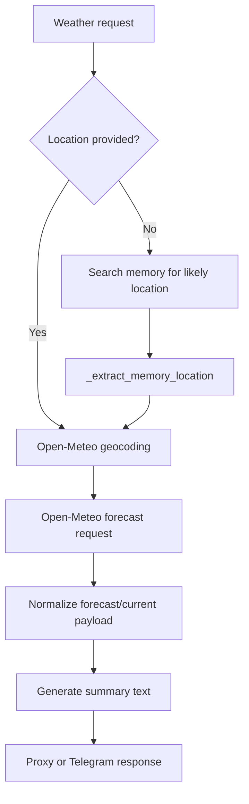

# Weather Tool

## Product Purpose
The weather tool is a utility feature that combines external forecast data with CATBot's internal memory context. It shows how the assistant can answer practical real-world questions with both API data and personalization.

## User-Facing Behavior
- Users can request a weather summary, current conditions, or more detailed forecast-oriented output.
- If the user does not provide a location, CATBot can try to infer one from stored memories.
- Weather is available through the proxy route, Telegram tool flows, and internal tool execution contexts.
- The output is normalized into a structured response plus a summary string that the assistant can reuse directly.

## How It Works
- `src/servers/proxy_server.py` defines `OPEN_METEO_FORECAST_BASE_URL`, `OPEN_METEO_GEOCODING_BASE_URL`, timeout settings, and hostname allowlist checks for the Open-Meteo integration.
- `_do_proxy_weather(location, detail, user_id, memory_manager)` is the shared weather service used across product surfaces.
- If no location is supplied, the function can search memory and use `_extract_memory_location(...)` to infer a likely saved location from prior user context.
- The service first calls the Open-Meteo geocoding endpoint to resolve the location into coordinates.
- It then calls the forecast endpoint, formats the returned data into a friendly structured payload, and derives a user-facing summary.
- `GET /v1/proxy/weather` is the public route into the feature.
- Telegram uses the `weatherInfo` tool in `src/servers/telegram_tools.py`, which forwards to the shared `do_weather` callback and returns the summary plus the structured data.

## Expanded Flow Diagram

## Primary Code References
- `src/servers/proxy_server.py`
  Weather configuration constants for Open-Meteo base URLs, timeouts, and allowlisting.
- `src/servers/proxy_server.py`
  Shared service: `_do_proxy_weather(...)`.
- `src/servers/proxy_server.py`
  Memory fallback helper: `_extract_memory_location(...)`.
- `src/servers/proxy_server.py`
  Route: `GET /v1/proxy/weather`.
- `src/servers/telegram_tools.py`
  Telegram tool path: `weatherInfo`.
- `tests/test_proxy_weather.py`
  Proxy-level weather behavior and memory-fallback coverage.
- `docs/weather_tool_implementation_plan.md`
  Design notes for the weather integration and Telegram/tool wiring.

## Data and Dependencies
- Depends on Open-Meteo geocoding and forecast endpoints.
- Optional personalization depends on the long-term memory system being available and containing a usable location.
- Returns both machine-usable fields and a human-facing summary string.

## Constraints and Notes
- The service validates Open-Meteo host configuration to reduce misrouting or unsafe endpoint substitution.
- Memory-based location inference is best-effort and only works if CATBot has stored relevant user-location context.
- This feature is intended for practical utility, so the summary layer matters almost as much as the raw forecast data.

## Related Docs
- [Long-Term Memory System](14_long_term_memory_system.md)
- [Tool-Enabled Telegram](38_tool_enabled_telegram.md)
- [Security Controls](45_security_controls.md)
