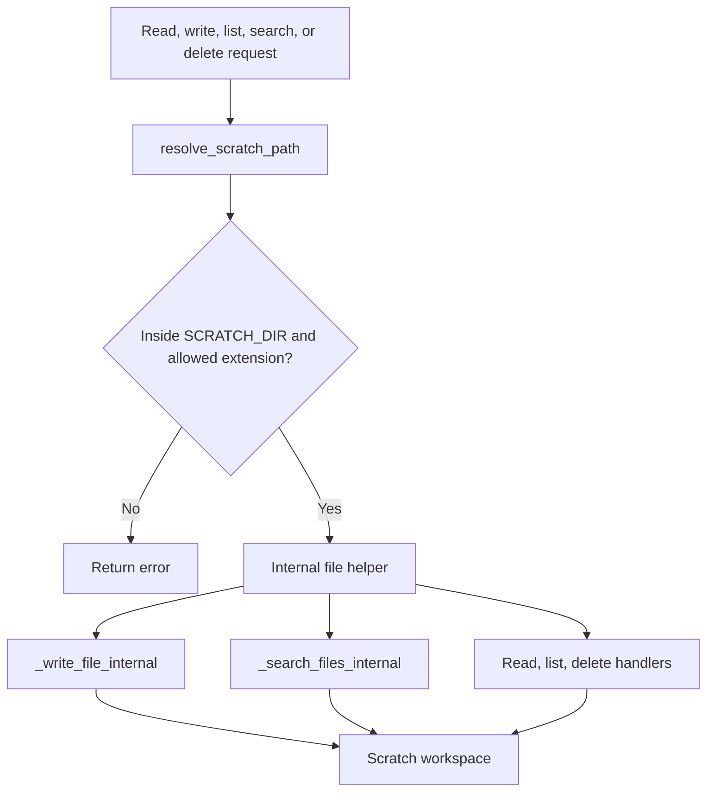

# File Workspace

## Product Purpose
The file workspace gives CATBot a bounded area where it can manipulate artifacts safely. This is the bridge between "assistant that talks" and "assistant that can actually produce, inspect, and move working files."

## User-Facing Behavior
- CATBot can read, write, list, search, and delete files inside the scratch workspace.
- The workspace supports both direct API usage and tool-driven access from Telegram, task execution, and skills.
- File paths are scratch-relative rather than arbitrary host paths.
- Attachments and generated artifacts can later be revisited through the same workspace model.

## How It Works
- `src/servers/proxy_server.py` uses `resolve_scratch_path(...)` as the core containment check. It resolves a requested path, enforces extension restrictions, and ensures the final path stays inside `SCRATCH_DIR`.
- Internal helpers such as `_write_file_internal(...)` and `_search_files_internal(...)` centralize the actual file operations so routes and tool adapters do not duplicate filesystem logic.
- The proxy exposes a set of file APIs:
- `POST /v1/files/read`
- `GET /v1/files/content`
- `POST /v1/files/write`
- `GET /v1/files/list`
- `GET /v1/files/search`
- `DELETE /v1/files/delete/{filename}`
- Telegram and skill consumers receive callbacks like `write_file_internal` and `search_files_internal`, so they stay on the same secure path instead of bypassing the proxy safeguards.
- `src/skills/builtin/filesystem_skill.py` exposes the scratch workspace as structured tools such as `filesystem.read_text`, `filesystem.write_text`, `filesystem.list_files`, and `filesystem.search_files`.

## Expanded Flow Diagram

## Primary Code References
- `src/servers/proxy_server.py`
  Core security helper: `resolve_scratch_path(...)`.
- `src/servers/proxy_server.py`
  Internal helpers: `_write_file_internal(...)` and `_search_files_internal(...)`.
- `src/servers/proxy_server.py`
  Routes: `/v1/files/read`, `/v1/files/content`, `/v1/files/write`, `/v1/files/list`, `/v1/files/search`, and `/v1/files/delete/{filename}`.
- `src/servers/telegram_tools.py`
  Uses backend-provided file callbacks instead of independent filesystem logic.
- `src/skills/builtin/filesystem_skill.py`
  Structured skill-facing file operations.
- `tests/test_proxy_file_security.py`
  Path-containment and extension-safety coverage.
- `tests/test_file_operations.py`
  Multi-format file read/write coverage.

## Data and Dependencies
- Depends on the configured scratch directory and extension allowlists.
- Document-reading quality depends on file-reader utilities and optional document libraries.
- Many other CATBot features depend on this workspace as their artifact layer.

## Constraints and Notes
- This is intentionally not general disk access. The point is bounded, auditable file manipulation.
- Path traversal protection is central to the design and enforced before file operations run.
- File tools become much more powerful when combined with task execution, Telegram, document support, and export workflows.

## Related Docs
- [Multimodal Inputs](10_multimodal_inputs.md)
- [Document Support](29_document_support.md)
- [Security Controls](45_security_controls.md)
