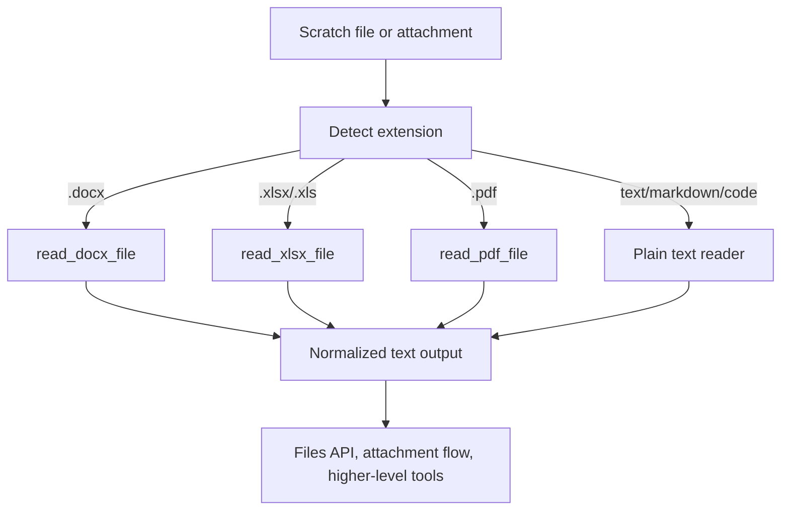

# Document Support

## Product Purpose
Document support lets CATBot work with the file formats people actually use. This extends the assistant beyond plain text into office files, PDFs, presentations, and images that can be read, written, or transformed inside the scratch workflow.

## User-Facing Behavior
- CATBot can inspect common document formats instead of only raw `.txt` or `.md` files.
- File tools and attachment flows can operate on office files and PDFs.
- Some formats are supported mainly for reading, while others have both read and write support.
- Higher-level features such as slide generation and Telegram file flows build on these capabilities.

## How It Works
- `src/utils/file_readers.py` provides format-aware readers such as `read_docx_file(...)`, `read_xlsx_file(...)`, and `read_pdf_file(...)`.
- `read_file_with_type(...)` routes a file path to the correct parser and reports the output in a normalized form.
- The file-reader layer tracks missing optional dependencies such as `python-docx` and `PyPDF2`, which lets CATBot fail more clearly when document support is incomplete.
- The proxy and workspace features consume these readers when serving file content, attachment inspection, or document-driven workflows.
- Write-side behavior is covered in the file operations stack and tests for formats such as DOCX, XLSX, and PDF.

## Expanded Flow Diagram

## Primary Code References
- `src/utils/file_readers.py`
  Format readers: `read_docx_file(...)`, `read_xlsx_file(...)`, and `read_pdf_file(...)`.
- `src/utils/file_readers.py`
  Dispatcher: `read_file_with_type(...)`.
- `src/servers/proxy_server.py`
  File and attachment routes that consume normalized file-reader output.
- `tests/test_file_operations.py`
  Read/write validation for txt, DOCX, XLSX, PDF, and image-related flows.
- `tests/verify_file_operations.py`
  Environment and dependency verification for document support.

## Data and Dependencies
- Depends on optional packages such as `python-docx` and `PyPDF2` for some formats.
- Uses the scratch workspace as the default file domain for document operations.
- Document output often becomes prompt context rather than being preserved in original rich formatting.

## Constraints and Notes
- Rich document fidelity is not the same as perfect round-trip editing of every format. Many flows extract readable text rather than preserve every layout detail.
- Missing optional parser dependencies will limit feature coverage for some file types.
- This layer is a capability foundation for multiple other features rather than a single end-user workflow on its own.

## Related Docs
- [File Workspace](28_file_workspace.md)
- [Multimodal Inputs](10_multimodal_inputs.md)
- [PDF and Markdown to PowerPoint](30_pdf_and_markdown_to_powerpoint.md)
