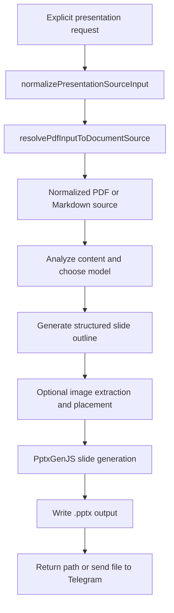

# PDF and Markdown to PowerPoint

## Product Purpose
This feature turns source material into a presentation artifact. It is one of CATBot's clearest examples of a deliverable-oriented workflow: the assistant can take PDF or Markdown input and produce a slide deck instead of only summarizing the source.

## User-Facing Behavior
- Users can explicitly ask CATBot to convert a PDF or Markdown document into a `.pptx` presentation.
- The feature accepts multiple source forms, including scratch-relative paths, uploaded attachments, URLs, inline Markdown, and legacy PDF-style inputs.
- CATBot is instructed not to call this tool unless the user explicitly wants a presentation or slide deck.
- Telegram can invoke the same backend callback and then send the resulting PowerPoint file back to chat.

## How It Works
- `js/app.js` defines the `pdfToPowerPoint` tool, including strong prompt guidance that limits its use to explicit presentation requests.
- `normalizePresentationSourceInput(sourceInput, explicitType = '')` standardizes the source description so the rest of the pipeline can handle URLs, attachment paths, Markdown, and other source forms consistently.
- `resolvePdfInputToDocumentSource(pdfUrl)` resolves simple PDF or Markdown source inputs into the normalized document-source structure used by the generator.
- The generation path analyzes the source content, chooses an appropriate model, produces structured slide content, and then uses `PptxGenJS` to build the final `.pptx`.
- For PDF-based inputs, the workflow can extract images and incorporate them into slides when the generator decides they are relevant.
- `index.html` loads the `pptxgenjs` bundle required for client-side PowerPoint generation.
- Telegram maps `pdfToPowerPoint` through `src/servers/telegram_tools.py`, where the backend callback can create the deck and then send the produced file to Telegram.
- Related Google Slides generation paths live in `src/skills/builtin/googleworkspace_cli_skill.py`, which is separate from the local `.pptx` flow but conceptually adjacent.

## Expanded Flow Diagram

## Primary Code References
- `js/app.js`
  Tool registration and usage guidance for `pdfToPowerPoint`.
- `js/app.js`
  Source normalization helpers: `normalizePresentationSourceInput(...)` and `resolvePdfInputToDocumentSource(...)`.
- `js/app.js`
  Slide-generation path using `PptxGenJS`.
- `index.html`
  Loads the `pptxgenjs` bundle used by the feature.
- `src/servers/telegram_tools.py`
  Telegram-side `pdfToPowerPoint` handling and file-send flow.
- `src/skills/builtin/googleworkspace_cli_skill.py`
  Adjacent Google Slides generation path for markdown-driven decks.
- `tests/test_index_refactor.py`
  Coverage ensuring the tool is only described for explicit conversion use cases.
- `tests/test_telegram_tools.py`
  Telegram callback coverage for PowerPoint creation and file sending.

## Data and Dependencies
- Depends on the source document being resolvable into a supported normalized input form.
- Depends on `PptxGenJS` for local `.pptx` generation.
- Image-aware slide generation depends on both source extraction and model-driven structuring.

## Constraints and Notes
- The feature is intentionally constrained by prompt guidance so it does not get used as a generic document reader.
- It produces a new presentation artifact; it is not a layout-preserving conversion of arbitrary PDFs.
- There is a conceptual split between local PowerPoint generation and Google Slides generation, even though both serve "turn source material into slides" workflows.

## Related Docs
- [Document Support](29_document_support.md)
- [File Workspace](28_file_workspace.md)
- [Google Workspace Skill](33_google_workspace_skill.md)
