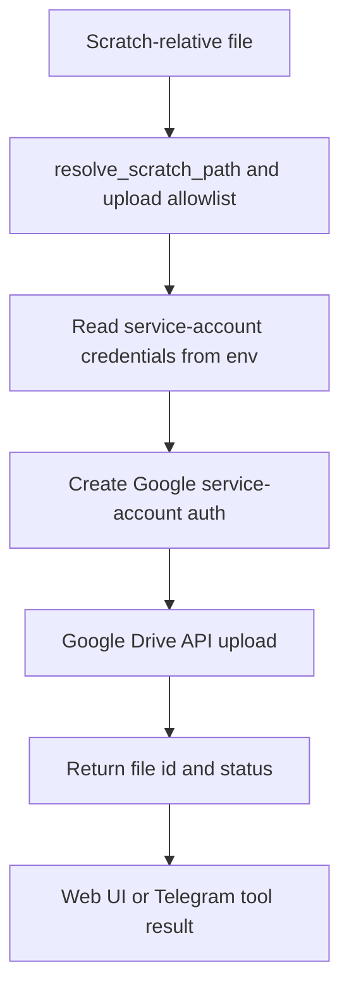

# Google Drive Upload

## Product Purpose
Google Drive upload is the export bridge from CATBot's bounded scratch workspace into an external storage system. It lets locally generated artifacts leave the assistant runtime in a controlled way.

## User-Facing Behavior
- Users can upload a scratch-relative file to Google Drive through the proxy.
- Web flows can trigger this directly from the frontend.
- Telegram tool flows can reuse the same capability through an internal helper path.
- Successful uploads return Google Drive file identifiers that can be used in later workflows.

## How It Works
- `js/app.js` implements `handleGoogleDriveUpload()`, which sends a request to the backend with the scratch-relative filename.
- `src/servers/proxy_server.py` exposes `/v1/proxy/upload-to-drive`.
- Before any upload occurs, the backend validates the requested file path with `resolve_scratch_path(...)` and enforces a dedicated allowlist for Drive-uploadable file types.
- The upload code assembles service-account credentials from environment variables, builds Google auth objects, and then calls the Drive API client.
- `src/servers/proxy_server.py` also defines an internal upload helper for Telegram tool usage so Telegram can send already-generated scratch artifacts to Drive without bypassing path or credential validation.

## Expanded Flow Diagram

## Primary Code References
- `js/app.js`
  Frontend upload path: `handleGoogleDriveUpload()`.
- `src/servers/proxy_server.py`
  Product route: `/v1/proxy/upload-to-drive`.
- `src/servers/proxy_server.py`
  Internal Telegram-facing Drive upload helper.
- `src/servers/proxy_server.py`
  Scratch-path validation and Drive-upload extension checks.
- `tests/test_proxy_file_security.py`
  Security coverage relevant to scratch path enforcement for file operations and uploads.

## Data and Dependencies
- Depends on Google service-account credentials in environment configuration.
- Depends on the requested file already existing inside the scratch workspace.
- Upload targets the configured Drive folder rather than arbitrary filesystem destinations.

## Constraints and Notes
- This feature is intentionally restricted to scratch-relative files to prevent arbitrary host-file exfiltration.
- Google API client libraries must be installed for upload support to work.
- It is an export workflow, not a full Google Drive browser or sync client.

## Related Docs
- [File Workspace](28_file_workspace.md)
- [Google Workspace Skill](33_google_workspace_skill.md)
- [Security Controls](45_security_controls.md)
