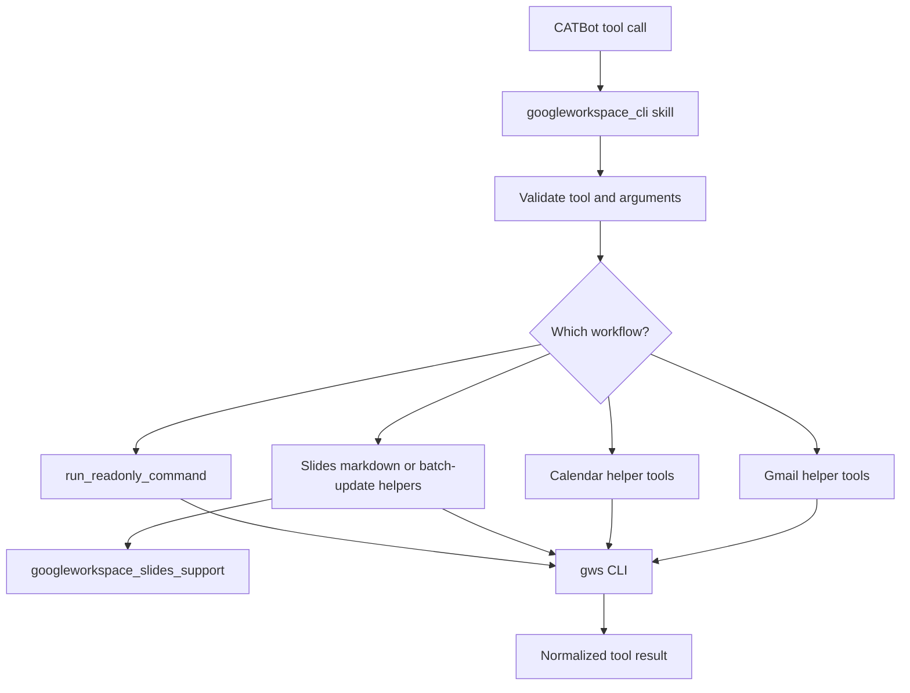

# Google Workspace Skill

## Product Purpose
The Google Workspace skill gives CATBot a structured interface into Gmail, Calendar, Slides, and other `gws` CLI-backed workflows. It converts external productivity commands into governed skill tools inside the CATBot platform.

## User-Facing Behavior
- CATBot can check Google Workspace CLI availability and auth status.
- The skill exposes Gmail, Calendar, and Slides-oriented operations as first-class tools instead of free-form shell execution.
- Markdown-driven slide creation is supported through a higher-level tool, not only low-level raw commands.
- Some commands are intentionally constrained to prevent unsafe or overly broad mutations.

## How It Works
- The manifest `src/skills/manifests/googleworkspace_cli.skill.json` loads `src/skills/builtin/googleworkspace_cli_skill.py`.
- The skill wraps `gws` command execution, normalizes tool payloads, and validates which commands or subcommands are allowed.
- `run_readonly_command` provides a controlled path for safe command execution, while mutating operations are exposed through explicit higher-level tool methods rather than arbitrary shell-like access.
- The skill includes dedicated helpers for Gmail list/read/send/draft operations, Calendar event creation and listing, and Google Slides flows.
- `slides_create_presentation_from_markdown` and `slides_batch_update_presentation` provide structured Google Slides generation and update paths.
- `src/skills/builtin/googleworkspace_slides_support.py` supports markdown-to-slide transformation and related slide-building helpers.
- The proxy tool registry is aware of important Google Workspace tool names and can shape prompts around them, especially for slide-oriented workflows.

## Expanded Flow Diagram

## Primary Code References
- `src/skills/builtin/googleworkspace_cli_skill.py`
  Main skill implementation and tool definitions.
- `src/skills/builtin/googleworkspace_slides_support.py`
  Slide-structure helpers used by markdown-driven presentation creation.
- `src/skills/manifests/googleworkspace_cli.skill.json`
  Skill registration manifest.
- `src/servers/proxy_server.py`
  Prompt/tool-registry awareness for important Google Workspace tools such as slide creation.
- `tests/test_skills_framework.py`
  Extensive coverage for Gmail, Calendar, Slides, auth checks, and command normalization behavior.
- `docs/SKILL_FRAMEWORK.md`
  Framework-level context for how the skill is loaded and executed.

## Data and Dependencies
- Depends on the external `gws` CLI and valid Google Workspace auth outside the core proxy.
- Slides workflows may write saved result artifacts into scratch for later retrieval.
- Gmail/Calendar/Slides all flow through the same skill abstraction instead of separate per-app integrations inside the proxy.

## Constraints and Notes
- The skill is intentionally opinionated: not every raw CLI action is exposed directly.
- This design keeps Google Workspace power inside the skill framework while reducing the risk of arbitrary command misuse.
- Slide creation here is Google Slides-oriented and complements, rather than replaces, the local `.pptx` generation workflow.

## Related Docs
- [PDF and Markdown to PowerPoint](30_pdf_and_markdown_to_powerpoint.md)
- [Google Drive Upload](31_google_drive_upload.md)
- [Skills Framework](42_skills_framework.md)
