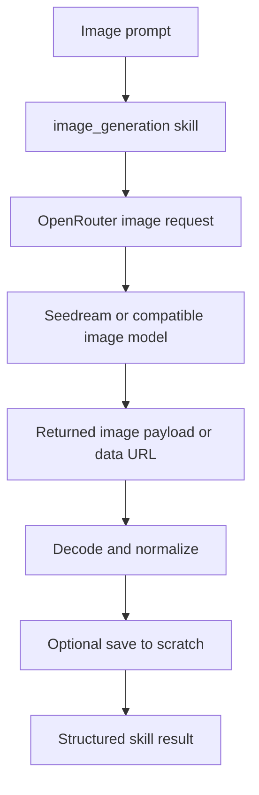

# Image Generation Skill

## Product Purpose
The image generation skill lets CATBot produce visual assets as part of a larger workflow. Instead of stopping at text descriptions, the assistant can return generated images, save them to scratch, and hand them off to later steps.

## User-Facing Behavior
- Users can request generated images through the CATBot skill layer.
- The skill can return structured image metadata and optionally save output into the scratch workspace.
- Generated images can become artifacts for later sharing, Telegram sending, or slide-building workflows.
- The skill is model-provider aware rather than hardcoding image bytes directly in the main proxy logic.

## How It Works
- The manifest `src/skills/manifests/image_generation.skill.json` loads `src/skills/builtin/image_generation_skill.py`.
- The skill builds an OpenRouter-compatible request targeting an image-capable model path such as Seedream 4.5.
- The upstream response can include a data URL or image payload that the skill decodes and optionally writes to a scratch-relative output path.
- The skill returns normalized output including relative paths, MIME type information, and optionally the raw data URL for downstream consumers.
- Because this lives inside the skill framework, the same image-generation capability can be used by chat, orchestration, or any tool-capable surface that has access to the skill manager.

## Expanded Flow Diagram

## Primary Code References
- `src/skills/builtin/image_generation_skill.py`
  Main image-generation logic and output shaping.
- `src/skills/manifests/image_generation.skill.json`
  Skill registration manifest.
- `docs/SKILL_FRAMEWORK.md`
  Framework-level execution model for skill calls.
- `scripts/install_wizard.py`
  Environment setup hints for OpenRouter-capable providers.

## Data and Dependencies
- Depends on OpenRouter-compatible credentials and an image-capable upstream model.
- Scratch persistence depends on the file workspace being available.
- Returned image payloads can feed into other CATBot artifact workflows.

## Constraints and Notes
- This is a raster-image generation path, not a vector-graphics or native design-editor workflow.
- Availability depends on upstream provider support and credentials.
- The skill returns structured outputs so generated images can be composed into later automation, not just displayed once.

## Related Docs
- [File Workspace](28_file_workspace.md)
- [Skills Framework](42_skills_framework.md)
- [Google Workspace Skill](33_google_workspace_skill.md)
