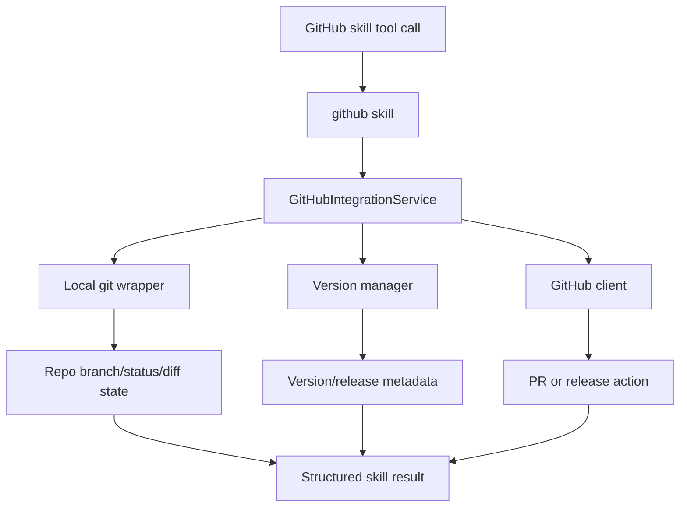

# GitHub Project Management Skill

## Product Purpose
The GitHub project management skill brings repository lifecycle work into CATBot. It gives the assistant structured tools for versioning, branch management, pull requests, releases, and related repo-safe operations.

## User-Facing Behavior
- CATBot can inspect repository state and perform controlled Git/GitHub workflow actions.
- The feature is oriented toward project-management and release flow tasks, not only raw code editing.
- PR creation, release preparation, and version bumping are exposed as structured skill operations.
- Sensitive or unsafe repo content is screened before some actions such as PR creation.

## How It Works
- The manifest `src/skills/manifests/github_project_manager.skill.json` loads the GitHub skill package under `src/skills/github/`.
- `src/skills/github/service.py` provides the integration service layer that coordinates git operations, GitHub client calls, and version-manager behavior.
- `src/skills/github/skill.py` exposes the structured tool surface that CATBot can call through the skill framework.
- The skill package separates concerns into git wrappers, models, service logic, and version-manager utilities instead of collapsing everything into one file.
- Service-level protections include checks around branch state, repository config, and sensitive-path handling before creating pull requests or releases.

## Expanded Flow Diagram

## Primary Code References
- `src/skills/manifests/github_project_manager.skill.json`
  Skill registration manifest.
- `src/skills/github/skill.py`
  Skill-facing tool definitions.
- `src/skills/github/service.py`
  Core integration and orchestration logic.
- `src/skills/github/`
  Supporting git wrappers, models, and version-manager modules.
- `tests/test_skills_github_service.py`
  Service-level behavior, including PR validation and sensitive-path protections.
- `tests/test_skills_framework.py`
  Framework-level coverage for GitHub skill execution.

## Data and Dependencies
- Depends on local git repository state plus any configured GitHub API credentials.
- Often works against the current workspace/repo rather than a remote-only abstraction.
- Release and PR workflows depend on both local branch state and remote GitHub availability.

## Constraints and Notes
- The skill is meant for structured repository workflows, not arbitrary shell-based git execution.
- Safety checks matter here because CATBot is operating close to source control and release surfaces.
- This feature complements Codex CLI integration rather than replacing it: one manages repo workflow, the other can help with actual coding tasks.

## Related Docs
- [Codex CLI Integration](40_codex_cli_integration.md)
- [Skills Framework](42_skills_framework.md)
- [Security Controls](45_security_controls.md)
