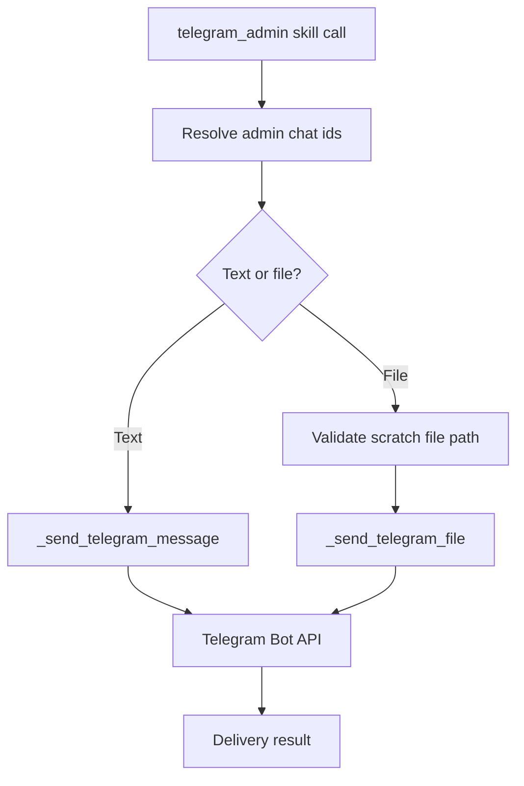

# Telegram Admin Skill

## Product Purpose
The Telegram admin skill gives CATBot a proactive operator-notification channel. Instead of only replying inside an existing conversation, CATBot can push messages or files out to configured Telegram admin recipients.

## User-Facing Behavior
- CATBot can send text notifications to admin chats.
- CATBot can send files from the scratch workspace to those chats.
- The skill is useful for workflow completion notices, backup alerts, and operational summaries.
- Delivery targets can come from runtime context services or environment-backed configuration.

## How It Works
- The manifest `src/skills/manifests/telegram_admin.skill.json` loads `src/skills/builtin/telegram_admin_skill.py`.
- The skill resolves target admin chat IDs using configuration and context services exposed by the rest of CATBot.
- `_send_telegram_message(...)` and `_send_telegram_file(...)` implement the actual delivery behavior.
- File sends are constrained to scratch-relative artifacts rather than arbitrary host paths, which keeps the admin-notification path aligned with CATBot's bounded file model.
- The main Telegram bot implementation and proxy helper functions provide the lower-level primitives that the skill can reuse for real Telegram delivery.

## Expanded Flow Diagram

## Primary Code References
- `src/skills/builtin/telegram_admin_skill.py`
  Main skill implementation and admin-target resolution logic.
- `src/skills/builtin/telegram_admin_skill.py`
  Delivery helpers: `_send_telegram_message(...)` and `_send_telegram_file(...)`.
- `src/skills/manifests/telegram_admin.skill.json`
  Skill registration manifest.
- `src/integrations/telegram_bot.py`
  Bot-side integration layer used by CATBot's Telegram surface.
- `tests/test_skills_telegram_admin.py`
  Skill behavior coverage for message and file sends.

## Data and Dependencies
- Depends on a configured Telegram bot token and resolvable admin chat IDs.
- File sending depends on scratch workspace availability and safe path validation.
- Works best as a downstream notification channel for other CATBot workflows.

## Constraints and Notes
- This is an outbound notification feature, not the main interactive Telegram chat surface.
- The skill depends on the Telegram integration being correctly configured.
- File delivery still inherits CATBot's bounded file-access model rather than opening a general-purpose file-send channel.

## Related Docs
- [Telegram Bot Interface](37_telegram_bot_interface.md)
- [File Workspace](28_file_workspace.md)
- [Operational Tooling](44_operational_tooling.md)
