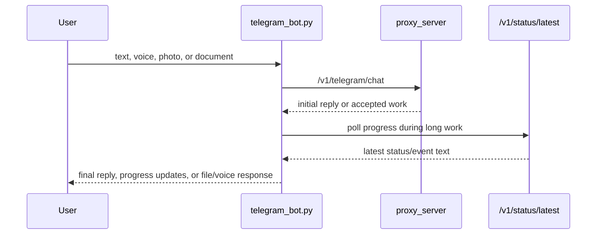

# Telegram Bot Interface

## Product Purpose
The Telegram bot gives CATBot a mobile and messaging-native surface without duplicating the backend. It extends the assistant beyond the browser while still routing through the same core proxy, memory, task, and tooling systems.

## User-Facing Behavior
- Users can chat with CATBot over Telegram using text, voice notes, photos, and documents.
- The bot supports commands such as `/start`, `/help`, `/status`, `/clear`, `/restart`, and `/backup`.
- During longer operations, the bot can poll for backend progress updates and relay them back into Telegram.
- Voice replies and media handling can be layered onto the basic chat flow.

## How It Works
- `src/integrations/telegram_bot.py` uses `python-telegram-bot` as the Telegram client runtime.
- Incoming messages are normalized and forwarded to the backend route `/v1/telegram/chat`.
- Progress polling uses `/v1/status/latest`, which allows Telegram to surface long-running backend activity while the main operation is still in flight.
- The help text and command handlers define the public Telegram feature surface, including `/status`, `/clear`, `/restart`, and `/backup`.
- `_spawn_backup_worker(...)` launches the backup workflow for Telegram-triggered backup requests, keeping long backup work off the main bot handler path.
- The bot has dedicated reply helpers like `_send_telegram_text_reply(...)` and message/media-specific handling branches for different Telegram update types.

## Expanded Flow Diagram

## Primary Code References
- `src/integrations/telegram_bot.py`
  Main Telegram bot runtime and command handlers.
- `src/integrations/telegram_bot.py`
  Reply helper: `_send_telegram_text_reply(...)`.
- `src/integrations/telegram_bot.py`
  Backup path: `_spawn_backup_worker(...)` and `backup_bot_command(...)`.
- `src/servers/proxy_server.py`
  Telegram backend route: `/v1/telegram/chat`.
- `src/servers/proxy_server.py`
  Status endpoints: `/v1/status/latest` and related status-session routes.
- `docs/TELEGRAM_CONVERSATION_FLOW.md`
  End-to-end flow notes for Telegram request handling.
- `tests/test_telegram_bot.py`
  Bot behavior coverage.
- `tests/test_telegram_backup_command.py`
  Backup-command coverage.

## Data and Dependencies
- Depends on a configured Telegram bot token and reachable proxy backend.
- Progress updates depend on the status-event subsystem being healthy.
- Media support depends on backend attachment and transcription pathways.

## Constraints and Notes
- Telegram is a separate client process, not just a webhook inside the proxy.
- The bot is thin by design; most real capability is delegated to the proxy and shared backend systems.
- Command support makes Telegram more than just a mirror of browser chat, but the richest functionality still depends on backend tools and integrations.

## Related Docs
- [Telegram Voice Support](09_telegram_voice_support.md)
- [Tool-Enabled Telegram](38_tool_enabled_telegram.md)
- [Monitoring Dashboard](43_monitoring_dashboard.md)
