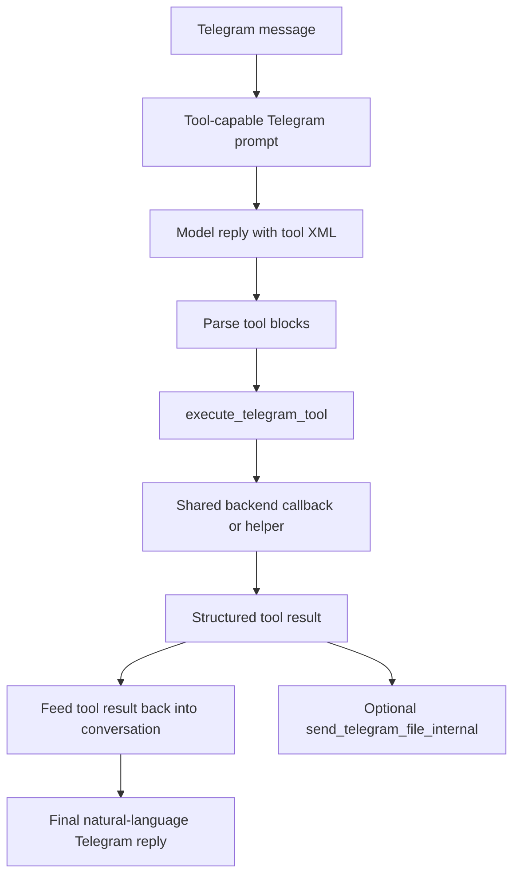

# Tool-Enabled Telegram

## Product Purpose
Tool-enabled Telegram turns the Telegram bot from a simple chat mirror into a first-class agent surface. It allows the Telegram conversation loop to call server-side tools for tasks, files, memory, browser work, research, and more.

## User-Facing Behavior
- Telegram conversations can trigger structured tools instead of only returning plain text model replies.
- Available tools include todo actions, memory operations, search, news, weather, file access, browser automation, deep research, Drive upload, workflow execution, and Codex.
- Tool results are fed back into the conversation loop so the final Telegram reply can combine tool output with natural-language explanation.
- The same Telegram interface can also send produced files back to the user when tool results generate artifacts.

## How It Works
- `src/servers/proxy_server.py` switches Telegram to a tool-capable system prompt when `TELEGRAM_TOOLS_ENABLED=true`.
- `src/servers/telegram_tools.py` implements `execute_telegram_tool(...)`, which is the dispatcher for tool calls coming out of the Telegram model loop.
- The Telegram tool layer parses XML-style tool blocks, normalizes parameters, routes to the appropriate backend callback or shared helper, and returns formatted results into the same conversation.
- The proxy injects a tool execution context containing callbacks such as `do_search`, `do_news`, `do_weather`, `do_browser_agent`, `do_deep_research`, `do_codex`, `write_file_internal`, `search_files_internal`, and `send_telegram_file_internal`.
- Telegram tool execution also integrates with persistent todo storage, memory management, Google Workspace tools, slide/presentation creation, and task execution commands.
- File-oriented tools can send generated scratch artifacts back into the current Telegram chat through `send_telegram_file_internal`.

## Expanded Flow Diagram

## Primary Code References
- `src/servers/proxy_server.py`
  Telegram tool-mode prompt selection and tool-context assembly.
- `src/servers/telegram_tools.py`
  Core dispatcher: `execute_telegram_tool(...)`.
- `src/servers/telegram_tools.py`
  Built-in Telegram tool branches for todo, memory, research, browser, Drive, weather, news, Codex, and presentation flows.
- `src/integrations/telegram_bot.py`
  Client surface that carries tool-enabled conversation over Telegram.
- `tests/test_telegram_tools.py`
  Extensive coverage for tool parsing and execution behavior.
- `docs/TELEGRAM_CONVERSATION_FLOW.md`
  Conversation-level explanation of the Telegram loop.

## Data and Dependencies
- Depends on the proxy's shared tools and helper callbacks.
- File/tool artifact flows depend on the scratch workspace and Telegram file-send helper.
- Tool-enabled Telegram inherits the availability constraints of whatever downstream tools are configured.

## Constraints and Notes
- Telegram tool calling is prompt- and parser-mediated, so robustness depends on both the model response format and the dispatcher logic.
- This surface is broad, but it is still constrained by the same backend safety checks used elsewhere in CATBot.
- Tool-enabled Telegram is one of the strongest examples of capability parity between the messaging surface and the browser surface.

## Related Docs
- [Telegram Bot Interface](37_telegram_bot_interface.md)
- [Todo System](18_todo_system.md)
- [Codex CLI Integration](40_codex_cli_integration.md)
