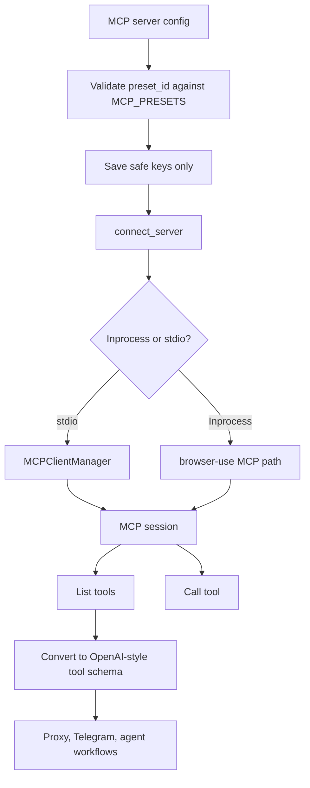

# MCP Extensibility

## Product Purpose
MCP extensibility is CATBot's external tool bus. It allows the platform to connect to Model Context Protocol servers and expose their tools inside the same assistant environment as CATBot's built-in features.

## User-Facing Behavior
- Users can configure and connect MCP servers through authenticated management routes.
- Connected MCP tools can be listed and called through CATBot rather than being managed separately.
- Browser-use is treated as a special MCP-style preset because it is central to CATBot's browsing stack.
- MCP-backed capabilities can be folded into agentic workflows alongside native skills and proxy routes.

## How It Works
- `src/servers/proxy_server.py` stores MCP server definitions in `config/mcp_servers.json`.
- The server-side allowlist `MCP_PRESETS` defines which MCP presets are allowed to execute. This prevents arbitrary user-supplied command execution.
- `MCPClientManager` owns the transport lifecycle for MCP clients and only resolves command/args from trusted preset definitions.
- `load_mcp_servers()` migrates older server configs into the safer `preset_id` model and strips unsafe command persistence.
- `save_mcp_servers()` only writes safe keys defined in `MCP_SERVER_SAFE_KEYS`.
- Authenticated management routes cover add/update/clear, list, connect, disconnect, tool listing, and tool invocation.
- Browser-use is handled specially as an in-process preset, while stdio MCP servers go through the normal client-manager connect path.
- The proxy can also convert MCP-style tool metadata into OpenAI-style tool definitions so the rest of CATBot can consume them in model tool-calling loops.

## Expanded Flow Diagram

## Primary Code References
- `src/servers/proxy_server.py`
  MCP preset allowlist: `MCP_PRESETS`.
- `src/servers/proxy_server.py`
  MCP client lifecycle: `MCPClientManager`.
- `src/servers/proxy_server.py`
  Persistence helpers: `load_mcp_servers()` and `save_mcp_servers()`.
- `src/servers/proxy_server.py`
  Safe persistence keys: `MCP_SERVER_SAFE_KEYS`.
- `src/servers/proxy_server.py`
  Management and connection endpoints beginning at the MCP server management section.
- `src/mcp/mcp_browser_client.py`
  Browser-oriented MCP integration path.
- `config/mcp_servers.json`
  Stored MCP server configuration.
- `tests/test_mcp_security.py`
  Security expectations for MCP server handling.
- `tests/test_mcp_client.py`
  MCP client behavior coverage.

## Data and Dependencies
- Depends on MCP SDK availability and any configured external MCP servers.
- Uses persisted MCP server config on disk, but only for safe fields.
- Tool schemas may be converted for reuse in CATBot's other model/tool orchestration layers.

## Constraints and Notes
- The code deliberately avoids executing user-supplied arbitrary commands for MCP connections.
- Browser-use is treated as a special preset because it is effectively part of CATBot's own runtime architecture.
- MCP adds a large amount of extensibility, but it also expands the system's operational and security surface.

## Related Docs
- [Browser Automation](22_browser_automation.md)
- [Skills Framework](42_skills_framework.md)
- [Security Controls](45_security_controls.md)
