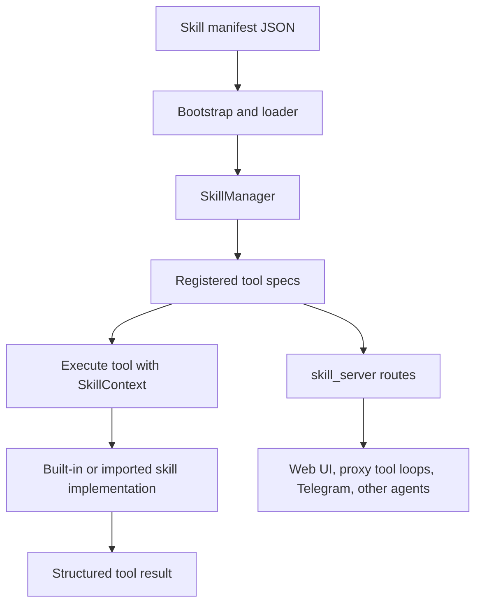

# Skills Framework

## Product Purpose
The skills framework is CATBot's internal plugin system. It provides a structured way to load, register, execute, package, and expose reusable capabilities without turning the proxy into a single giant file of one-off routes.

## User-Facing Behavior
- CATBot can load built-in and imported skill manifests.
- Skill tools can be listed and executed through API routes and tool-capable surfaces.
- Skills can be exported or packaged for reuse.
- Many major integrations in CATBot, including Spotify, Google Workspace, files, Telegram admin, and image generation, arrive through this framework.

## How It Works
- `src/skills/` contains the core abstractions for manifests, tool specs, execution context, manager logic, and packaging.
- `src/skills/bootstrap.py` and the default-skill-manager creation path load manifests from the configured manifest directory.
- Built-in manifests live under `src/skills/manifests/`.
- `SkillManager.from_manifest_directory(...)` is the main loading path used throughout tests and runtime setup.
- `src/skills/skill_server.py` exposes the skill API surface for listing tools, executing tools, and importing/exporting packaged skill artifacts.
- The proxy can format skill tools into MCP-like or OpenAI-like schema shapes so skills participate naturally in CATBot's model tool-calling loops.
- Because skills run inside a structured execution context, they can receive bounded resources such as `scratch_dir` instead of arbitrary process-wide access.

## Expanded Flow Diagram

## Primary Code References
- `src/skills/`
  Core framework package.
- `src/skills/bootstrap.py`
  Default manager/bootstrap logic.
- `src/skills/skill_server.py`
  API surface for skill listing, execution, import, and export.
- `src/skills/manifests/`
  Built-in skill manifests.
- `src/servers/proxy_server.py`
  Integration points that format skills into tool schemas for other agent loops.
- `docs/SKILL_FRAMEWORK.md`
  Framework-specific design notes and usage patterns.
- `tests/test_skills_framework.py`
  Extensive coverage across manifest loading and tool execution.
- `tests/test_skills_api.py`
  API-level coverage for skill import/export and execution.

## Data and Dependencies
- Depends on manifest discovery and the skill implementation modules referenced by those manifests.
- Skill execution context can include scratch paths and service handles instead of unrestricted global access.
- Imported skills extend CATBot without requiring direct edits to the proxy feature surface.

## Constraints and Notes
- The framework is powerful because it standardizes capability shape, but that also means manifest quality and validation matter.
- Skills are not equivalent to arbitrary Python execution; they are structured tools loaded through a controlled registry.
- This framework is the main reason CATBot can keep growing feature breadth without collapsing entirely into `proxy_server.py`.

## Related Docs
- [MCP Extensibility](41_mcp_extensibility.md)
- [Google Workspace Skill](33_google_workspace_skill.md)
- [GitHub Project Management Skill](35_github_project_management_skill.md)
