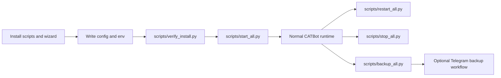

# Operational Tooling

## Product Purpose
Operational tooling is the part of CATBot that makes the system runnable and maintainable as a local product. Installation, startup, verification, restart, and backup are treated as product capabilities rather than informal developer chores.

## User-Facing Behavior
- CATBot can be installed and configured through guided scripts.
- The standard service set can be started, restarted, and stopped through dedicated lifecycle scripts.
- Verification tooling helps confirm that required runtimes and integrations are in place.
- Backup tooling can create ZIP archives and integrate with Telegram-triggered backup workflows.

## How It Works
- `install.ps1`, `install.sh`, and `scripts/install_wizard.py` guide setup, workflow-backend selection, configuration, and `.env` writing.
- `scripts/install_optional_workflow_backend.py` installs optional backend dependencies such as `ag2[openai]` when `WORKFLOW_FRAMEWORK=ag2`.
- `scripts/start_all.py` verifies the selected `WORKFLOW_FRAMEWORK` and then launches the standard CATBot runtime set, including the proxy, frontend server, poller, browser bridge pieces, and optional Telegram process.
- `scripts/restart_all.py` verifies the selected workflow backend before stopping existing services, then uses `scripts/stop_all.py` and `scripts/start_all.py` for process lifecycle management.
- `scripts/backup_all.py` creates ZIP backups and is also invoked from the Telegram bot's backup worker flow.
- `scripts/verify_install.py` performs post-install verification for core runtime pieces such as AutoGen, the selected workflow backend, MCP/browser-use, provider env settings, and optional dependencies.
- Supporting scripts such as `scripts/check_prereqs.py` and `scripts/setup_env_and_dirs.py` help enforce a runnable local environment.

## Expanded Flow Diagram

## Primary Code References
- `install.ps1`
  Windows install path.
- `install.sh`
  Shell install path.
- `scripts/install_wizard.py`
  Guided configuration workflow.
- `scripts/install_optional_workflow_backend.py`
  Optional selected workflow-backend dependency install.
- `scripts/start_all.py`
  Standard service launcher.
- `scripts/restart_all.py`
  Restart lifecycle helper.
- `scripts/stop_all.py`
  Stop lifecycle helper.
- `scripts/backup_all.py`
  Backup archive workflow.
- `scripts/verify_install.py`
  Post-install verification checks.
- `scripts/check_prereqs.py`
  Runtime prerequisite checks.
- `scripts/setup_env_and_dirs.py`
  Directory/env setup helpers.

## Data and Dependencies
- Depends on local runtime prerequisites such as Python, Node.js, browser-use dependencies, and configured `.env` values.
- Backup workflows depend on a stable project directory layout and writable backup destination.
- Verification scripts encode CATBot's assumptions about what a healthy local install looks like, including the selected `WORKFLOW_FRAMEWORK`.

## Constraints and Notes
- These scripts are operationally significant because CATBot is a multi-process local product.
- Verification and lifecycle tooling reduce setup entropy, especially when optional integrations are enabled.
- Backup and restart tooling also matter for non-browser surfaces such as Telegram administration.

## Related Docs
- [Self-Hosted Assistant Platform](01_self_hosted_assistant_platform.md)
- [Telegram Bot Interface](37_telegram_bot_interface.md)
- [Monitoring Dashboard](43_monitoring_dashboard.md)
