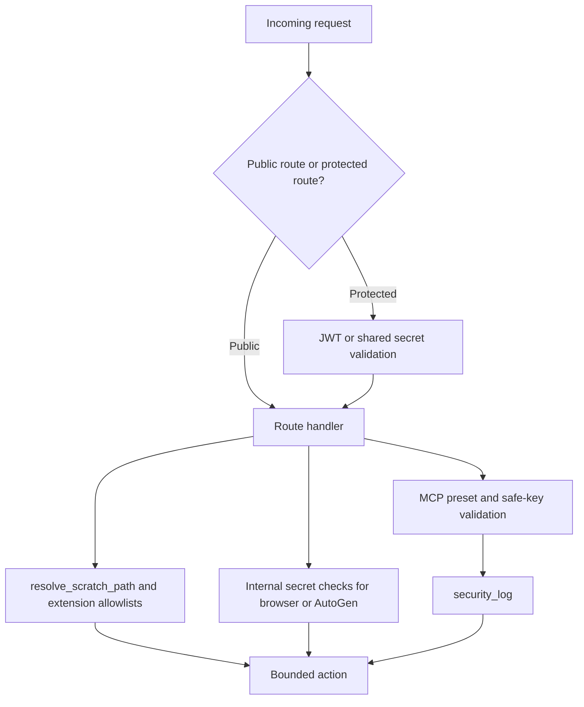

# Security Controls

## Product Purpose
CATBot has enough power to touch files, external services, tool servers, and long-running automation. The security layer is what keeps that power bounded and auditable instead of turning the assistant into an unsafe local control surface.

## User-Facing Behavior
- Most sensitive routes require authenticated access.
- File operations are limited to the scratch workspace and governed by extension allowlists.
- MCP configuration is restricted to server-side presets rather than arbitrary commands.
- Shared-secret gates protect internal automation routes such as the browser bridge and AutoGen team calls.
- Security-sensitive actions can be logged for audit-style inspection.

## How It Works
- `src/servers/proxy_server.py` defines JWT configuration and helpers such as `create_jwt(...)`, password verification, and route-level auth dependencies using `Depends(get_current_user)`.
- Scratch file access is guarded by `resolve_scratch_path(...)`, which canonicalizes paths, enforces containment, and can apply read/write extension allowlists.
- MCP security is built around `MCP_PRESETS`, `MCP_SERVER_SAFE_KEYS`, and `security_log(...)`, ensuring client-supplied commands are never persisted or executed directly.
- Shared-secret validation protects internal or privileged flows through helpers that accept `AUTOGEN_TEAM_SECRET` or `MCP_BROWSER_SERVER_SHARED_SECRET`.
- The browser bridge in `src/servers/mcp_browser_server.py` protects expensive automation endpoints behind its own shared-secret model.
- The repository documents these controls in `docs/SECURITY_OVERVIEW.md` and reinforces them with dedicated security-focused tests.

## Expanded Flow Diagram

## Primary Code References
- `src/servers/proxy_server.py`
  JWT configuration and auth helpers.
- `src/servers/proxy_server.py`
  Route-level auth usage through `Depends(get_current_user)`.
- `src/servers/proxy_server.py`
  Scratch-path containment helper: `resolve_scratch_path(...)`.
- `src/servers/proxy_server.py`
  MCP safety controls: `MCP_PRESETS`, `MCP_SERVER_SAFE_KEYS`, and `security_log(...)`.
- `src/servers/proxy_server.py`
  Shared-secret handling for AutoGen and browser-server integration.
- `src/servers/mcp_browser_server.py`
  Protected browser/deep-research API paths.
- `docs/SECURITY_OVERVIEW.md`
  Broader security design notes.
- `tests/test_mcp_security.py`
  MCP-focused security coverage.
- `tests/test_proxy_file_security.py`
  Scratch path and file-operation security coverage.

## Data and Dependencies
- Depends on configured secrets such as `JWT_SECRET`, `AUTOGEN_TEAM_SECRET`, and browser-server shared secrets.
- Security posture is partially shaped by which routes remain public for UX reasons.
- Audit-style logs and tests help verify that the controls are actually enforced.

## Constraints and Notes
- Security in CATBot is layered but pragmatic, not absolute. Some public convenience routes still exist and should be understood as exposed surface.
- The strongest controls are around files, privileged routes, and external tool execution paths.
- Because CATBot is self-hosted, safe defaults and explicit boundary checks matter more than relying on an external platform perimeter.

## Related Docs
- [File Workspace](28_file_workspace.md)
- [MCP Extensibility](41_mcp_extensibility.md)
- [Operational Tooling](44_operational_tooling.md)
